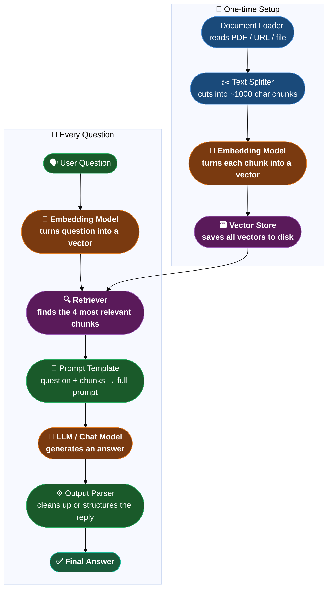

# LangChain Components — The Building Blocks

> Every LangChain app is built from the same set of lego bricks.
> Once you understand what each one does, you can snap them together to build almost anything.

---

## 1. LLM / Chat Model — The Brain

This is the AI model itself — the thing that actually reads your text and generates a response.

In LangChain, a **Chat Model** is just a wrapper around whichever AI model you want to use. You pick one, and from that point on you interact with it the same way no matter who made it.

```python
from langchain_google_genai import ChatGoogleGenerativeAI

model = ChatGoogleGenerativeAI(model="gemini-1.5-flash")
response = model.invoke("What is machine learning?")
print(response.content)
```

**The superpower:** You can swap Google Gemini for OpenAI or Mistral with literally one line change. Everything else in your app stays identical.

```
Google Gemini  →  ChatGoogleGenerativeAI(model="gemini-1.5-flash")
Mistral        →  ChatMistralAI(model="mistral-small-latest")
OpenAI         →  ChatOpenAI(model="gpt-4o")
Local (Ollama) →  ChatOllama(model="llama3")
```

Think of the chat model as the engine. LangChain is the steering wheel you use to drive any engine.

---

## 2. Prompt Template — The Reusable Fill-in-the-Blank

A raw string prompt works for a one-off question, but in a real app you ask the same kind of question hundreds of times with different inputs. Typing out the full prompt every time is messy and error-prone.

A **Prompt Template** is a prompt with placeholders — like a form with blank fields that get filled in at runtime.

```python
from langchain_core.prompts import ChatPromptTemplate

# Define the template ONCE with placeholders in curly braces
template = ChatPromptTemplate.from_messages([
    ("system", "You are a helpful assistant who explains things simply."),
    ("human",  "Explain {topic} in simple words for a {audience}.")
])

# Fill in the blanks at runtime — as many times as you want
prompt = template.invoke({
    "topic":    "neural networks",
    "audience": "10-year-old"
})

response = model.invoke(prompt)
```

**Why this matters:**
- Keeps your prompts clean and reusable
- Makes it easy to test different variations
- The system message (personality/rules) is baked in once — you never forget to include it
- Chains and agents depend on templates to work properly

---

## 3. Output Parser — Turning the AI's Reply into Something Usable

By default, the model gives you back a chunk of text. That's fine for a chatbot, but what if you need a Python list, a JSON object, or a properly structured data class?

An **Output Parser** sits after the model call and converts the raw text response into the exact Python object you need.

```python
from langchain_core.output_parsers import StrOutputParser
from langchain_core.output_parsers import JsonOutputParser
from langchain_core.output_parsers import PydanticOutputParser
```

**String parser** — just strips the metadata, gives you a clean string:
```python
parser = StrOutputParser()
result = parser.invoke(response)   # plain string instead of AIMessage object
```

**Pydantic parser** — tells the LLM to fill in a form and gives you a Python object:
```python
from pydantic import BaseModel
from typing import List

class JobPosting(BaseModel):
    job_title: str
    required_skills: List[str]
    salary_range: str

parser = PydanticOutputParser(pydantic_object=JobPosting)

# The parser generates instructions to inject into the prompt
format_instructions = parser.get_format_instructions()

# After the model responds with JSON, parse it into a Python object
job = parser.parse(response.content)
print(job.job_title)          # "Senior ML Engineer"
print(job.required_skills)    # ["Python", "TensorFlow", ...]
```

Think of it as telling the AI: "don't just write an essay — fill in this specific form."

---

## 4. Document Loader — Reading Files and Websites

Before you can ask an AI questions about your PDF or website, you need to actually read that content into Python. That's what a **Document Loader** does.

It reads a file (or URL), pulls out all the text, and wraps it in a standard `Document` object with two parts:
- `page_content` — the actual text
- `metadata` — where it came from (filename, page number, URL, etc.)

```python
from langchain_community.document_loaders import PyPDFLoader
from langchain_community.document_loaders import TextLoader
from langchain_community.document_loaders import WebBaseLoader

# Load a PDF — one Document per page
loader = PyPDFLoader("my_notes.pdf")
docs = loader.load()
print(docs[0].page_content)   # text from page 1
print(docs[0].metadata)       # {"source": "my_notes.pdf", "page": 0}

# Load a text file
loader = TextLoader("notes.txt")
docs = loader.load()

# Load a live webpage
loader = WebBaseLoader("https://example.com/article")
docs = loader.load()
```

LangChain has loaders for almost everything — PDFs, Word docs, CSVs, YouTube transcripts, Notion pages, Google Drive, databases. The output is always the same standard `Document` format, so the rest of your pipeline doesn't care what the source was.

---

## 5. Text Splitter — Cutting Big Documents into Chunks

LLMs can only read a limited amount of text at once (their "context window"). A large PDF might have 200 pages — you can't send all of that in one go.

A **Text Splitter** cuts your documents into smaller overlapping pieces called **chunks**. Each chunk is small enough to fit in a prompt, and the overlap makes sure an idea doesn't get cut off right at the seam between two chunks.

```python
from langchain_text_splitters import RecursiveCharacterTextSplitter

splitter = RecursiveCharacterTextSplitter(
    chunk_size=1000,    # aim for ~1000 characters per chunk
    chunk_overlap=200   # repeat last 200 characters in the next chunk
                        # so sentences don't get cut in half at the boundary
)

chunks = splitter.split_documents(docs)
# docs had 5 pages → chunks might now have 40 smaller pieces
```

**Why overlap?**

Imagine a sentence spans the very end of chunk 3 and the very start of chunk 4. Without overlap, you'd never have the full sentence in one place. With a 200-character overlap, both chunks include that boundary region, so nothing important falls through the cracks.

**Chunk size guide:**
```
Too large (5000+) → each chunk has multiple topics, search becomes imprecise
Too small (< 100) → each chunk loses context, "it" with no reference to what "it" is
Sweet spot: 400–1000 characters with 10–15% overlap
```

---

## 6. Embedding Model — Turning Text into Numbers That Capture Meaning

An **Embedding Model** converts a piece of text into a list of numbers — called a **vector**. The magic is that text with similar meaning gets similar numbers.

```python
from langchain_google_genai import GoogleGenerativeAIEmbeddings

embedding_model = GoogleGenerativeAIEmbeddings(model="models/embedding-001")

# Convert a sentence into a vector
vector = embedding_model.embed_query("What is machine learning?")
# → [0.021, -0.034, 0.098, ...]  — 768 numbers

# Convert multiple documents at once
vectors = embedding_model.embed_documents([
    "Machine learning is about learning from data.",
    "Deep learning uses neural networks.",
    "Paris is the capital of France."
])
```

This is not random — sentences about the same topic end up with vectors that are mathematically close to each other:

```
"I love dogs"     → [0.21, -0.45, 0.83, ...]
"I adore puppies" → [0.22, -0.43, 0.81, ...]   ← almost identical!

"The stock market" → [-0.91, 0.34, -0.22, ...]  ← completely different
```

**Where embeddings are used:**
- Storing document chunks in a vector database
- Converting a user's question into a vector so you can search for the most relevant chunks
- Semantic search — find results by meaning, not just matching words

---

## 7. Vector Store — A Database That Understands Meaning

A regular database stores rows and columns and lets you search by exact matches ("find all rows where name = Alice"). It has no concept of similarity.

A **Vector Store** stores embeddings and is built to answer: *"which of these stored chunks is closest in meaning to this question?"* — fast, even with millions of entries.

```python
from langchain_community.vectorstores import Chroma
from langchain_community.vectorstores import FAISS

# Build a vector store from your chunks + embedding model
# Under the hood: each chunk gets embedded → stored in the DB
vectorstore = Chroma.from_documents(
    documents=chunks,
    embedding=embedding_model,
    persist_directory="chroma_db"   # save to disk so you don't rebuild every time
)

# Search by meaning — finds chunks relevant to the question
# even if they don't share a single word
results = vectorstore.similarity_search("how does backpropagation work?", k=4)
```

Popular options:

| Vector Store | Type | Best for |
|---|---|---|
| **FAISS** | Local (runs in memory) | Learning, prototypes, no server needed |
| **Chroma** | Local or server | LangChain projects, easy to persist to disk |
| **Pinecone** | Cloud service | Production apps, massive scale |

---

## 8. Retriever — The Search Interface

A **Retriever** is a thin wrapper around a vector store that speaks LangChain's standard language. It takes a question and returns the most relevant documents — and that's its only job.

```python
# Basic similarity retriever — finds top 4 most relevant chunks
retriever = vectorstore.as_retriever(search_kwargs={"k": 4})

results = retriever.invoke("What is gradient descent?")
# returns a list of the 4 most relevant Document chunks
```

Retrievers can be smarter too:

**MMR (Max Marginal Relevance)** — picks results that are relevant AND varied, so you don't get 4 chunks all saying the same thing:
```python
retriever = vectorstore.as_retriever(
    search_type="mmr",
    search_kwargs={"k": 4, "fetch_k": 20}
)
```

**MultiQuery Retriever** — uses an LLM to rewrite your question several different ways, runs all of them, then combines the results. Useful when a single phrasing might miss good matches:
```python
from langchain_classic.retrievers.multi_query import MultiQueryRetriever

retriever = MultiQueryRetriever.from_llm(
    retriever=vectorstore.as_retriever(),
    llm=model
)
```

---

## How They All Fit Together

Here's the full picture of how these components connect in a typical RAG app:



---

## Quick Reference

| Component | Job | Key class |
|---|---|---|
| **LLM / Chat Model** | Generates text responses | `ChatGoogleGenerativeAI`, `ChatMistralAI`, `ChatOllama` |
| **Prompt Template** | Reusable fill-in-the-blank prompt | `ChatPromptTemplate` |
| **Output Parser** | Converts text reply → Python object | `StrOutputParser`, `PydanticOutputParser` |
| **Document Loader** | Reads files and websites into Documents | `PyPDFLoader`, `TextLoader`, `WebBaseLoader` |
| **Text Splitter** | Cuts big documents into small chunks | `RecursiveCharacterTextSplitter` |
| **Embedding Model** | Turns text into a vector of numbers | `GoogleGenerativeAIEmbeddings`, `OpenAIEmbeddings` |
| **Vector Store** | Stores vectors and searches by meaning | `Chroma`, `FAISS` |
| **Retriever** | Searches the vector store for relevant chunks | `vectorstore.as_retriever()`, `MultiQueryRetriever` |
