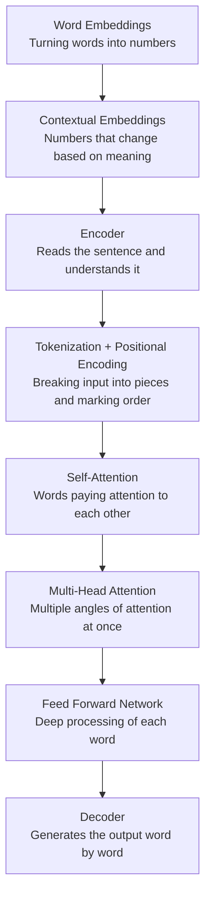
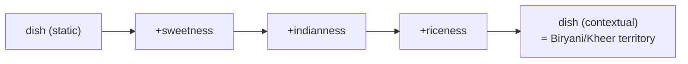
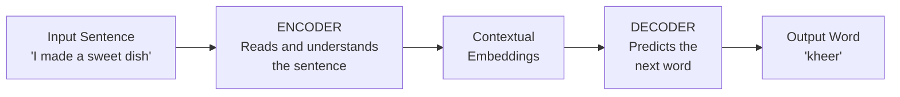
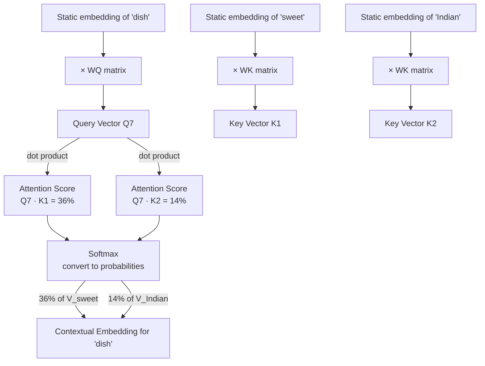
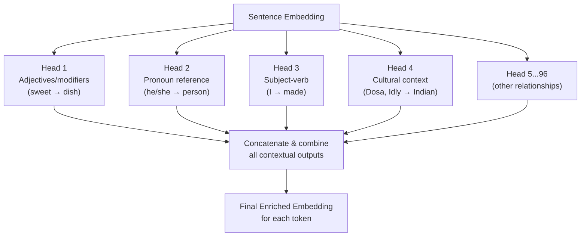
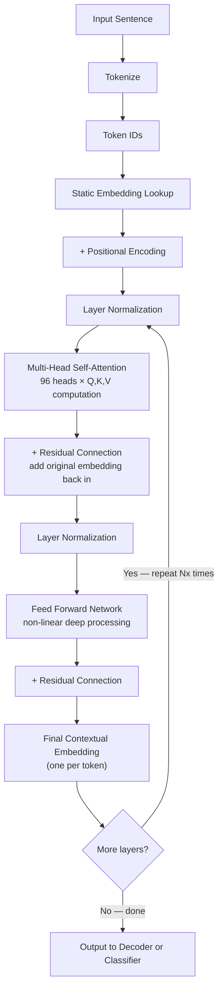
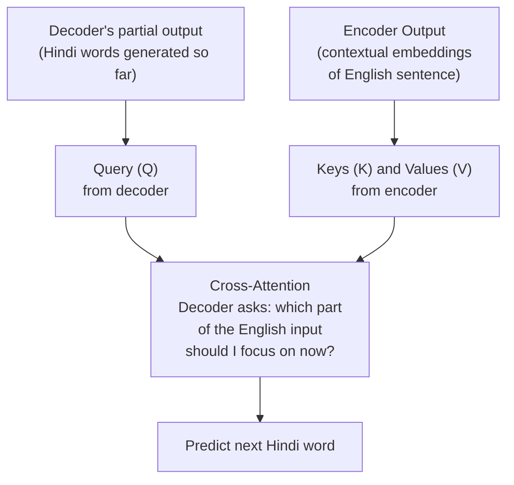
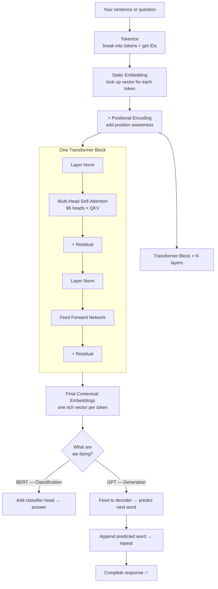
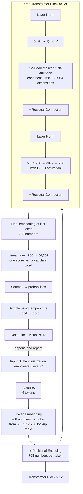

# Transformers — How Modern AI Actually Works

> The architecture behind GPT, BERT, Gemini, Claude, and basically every powerful AI model you've heard of.
> Written in plain English — no PhD required.

---

## The One Thing Every Language Model Does

Before anything else, understand this one fundamental idea:

**Every language model — no matter how fancy — is just predicting the next word.**

That's it. When you type something in ChatGPT, it doesn't "think" or "understand" the way you do. It looks at your words and asks: _what is the most likely next word?_ Then it predicts that word, adds it to the sentence, and asks the same question again. And again. Word by word until the answer is complete.

```
You type:  "The capital of France is"
Model:     predicts → "Paris"

You type:  "The capital of France is Paris"
Model:     predicts → "." (end)
```

That's the whole trick. It sounds too simple to be impressive — but when you do this billions of times with enormous amounts of text, the result is something that can write essays, explain code, and answer questions about almost anything.

---

## Before We Dive In — A Roadmap

Here's everything we'll cover:



---

## Part 1 — Word Embeddings: Turning Words into Numbers

AI models don't understand English. They understand numbers. So the first challenge is: **how do you turn a word into a number?**

The naive answer is: just give each word a fixed ID. King = 1, Queen = 2, Horse = 3. But that doesn't capture any meaning. The number 1 doesn't tell you that King is powerful, masculine, rich, and human.

### A Better Idea — Represent Words with a List of Numbers

Instead of one number, give each word a **vector** — a list of numbers — where each number describes some property of that word.

```
Questions we could ask about a word:

              Authority?  Has tail?  Is rich?  Gender (M=-1, F=+1)
King     →  [   1.0    ,    0.0   ,   1.0  ,      -1.0         ]
Queen    →  [   1.0    ,    0.0   ,   1.0  ,      +1.0         ]
Horse    →  [   0.0    ,    1.0   ,   0.0  ,       0.0         ]
Battle   →  [   0.5    ,    0.0   ,   0.0  ,       0.0         ]
```

Now King and Queen are **mathematically close** to each other (similar numbers) and both are **far from Horse** (very different numbers). The meaning is captured in the math.

### The Magic — You Can Do Arithmetic with Words

```
King  −  Man  +  Woman  =  Queen  ✅

Russia  −  Moscow  +  Delhi  =  India  ✅

Father  −  Man  +  Woman  =  Mother  ✅
```

This actually works. Words with similar relationships end up with vectors that point in the same direction in that number space.

```
         Queen
          ↑
          |  ← gender direction vector
          |
         King ────────────────► Uncle
                                  |
                                  | ← gender direction vector
                                  ↓
                                 Aunt
```

### How Are These Embeddings Created?

You train a neural network on billions of words of text — Wikipedia, books, the internet. The network learns the relationships between words from how often they appear near each other. The result is a table of vectors: one vector per word in the vocabulary.

These are called **static embeddings** — the vector for "King" is always the same no matter where you see the word. Models like **Word2Vec** and **GloVe** produce static embeddings.

> In Google's Word2Vec model, each word vector has **300 dimensions** — 300 numbers. GPT uses embedding vectors with up to **12,288 dimensions**.

---

## Part 2 — Contextual Embeddings: Why Static Isn't Enough

Static embeddings have a problem. Look at this word:

```
"The train will run on the track."
"My package is late, help me track it."
```

The word **"track"** means something completely different in each sentence. But a static embedding gives it the exact same vector both times. That's a problem when you're trying to predict the next word accurately.

### The Solution — Let Context Change the Embedding

What if the embedding for "track" could shift slightly depending on what words surround it?

```
Static embedding for "dish":
  dish → [0.3, -0.1, 0.8, ...]

After reading "sweet":
  dish + sweetness vector → [0.4, 0.2, 0.7, ...]

After reading "sweet Indian":
  dish + sweetness + indianness → [0.5, 0.6, 0.6, ...]
```

Each surrounding word nudges the embedding in a different direction until it has a rich, accurate meaning for this specific use of the word in this specific sentence.



This is what the Transformer architecture is built to do — generate **contextual embeddings**.

---

## Part 3 — The Transformer Architecture

The Transformer has two main parts:



| Part        | Job                                              | Used by              |
| ----------- | ------------------------------------------------ | -------------------- |
| **Encoder** | Reads the input, generates contextual embeddings | BERT                 |
| **Decoder** | Uses those embeddings to predict/generate words  | GPT                  |
| **Both**    | Full translation or seq-to-seq tasks             | Original Transformer |

> **BERT** uses encoder only — great for understanding tasks (classification, question answering).  
> **GPT** uses decoder only — great for generation tasks (writing, chatting, autocomplete).

---

## Part 4 — Inside the Encoder: Step by Step

### Step 1 — Tokenization

The sentence doesn't go in as whole words. It gets broken into **tokens** first.

```
Sentence:  "I called her."

Tokens:    ["I", "call", "ed", "her", "."]
```

A "token" is roughly a word or word-piece. "called" becomes two tokens: "call" + "ed". Each token gets a numeric ID from the vocabulary lookup table.

```
Token IDs:  I=50, call=1234, ed=89, her=220, .=12
```

BERT has ~30,000 tokens in its vocabulary. GPT has ~50,000.

Special tokens are also added:

```
[CLS] I call ed her . [SEP]
 ↑                      ↑
start token           end/separator token
```

---

### Step 2 — Static Embedding Lookup

For each token ID, look up its pre-trained embedding vector from the **embedding matrix** — a big table learned during training.

```
Vocabulary Embedding Matrix (simplified):
Token ID  |  Embedding Vector (768 numbers for BERT, 12288 for GPT)
----------|----------------------------------------------------------
50  (I)   |  [0.21, -0.45, 0.83, ...]
1234(call)|  [0.54, 0.12, -0.33, ...]
89  (ed)  |  [-0.11, 0.76, 0.22, ...]
...
```

---

### Step 3 — Positional Encoding

The Transformer processes all tokens **in parallel** (unlike older models that went word by word). This is fast, but it means the model has no idea what order the words came in.

"Dog bites man" and "Man bites dog" would look identical to it.

The fix: **add a small position vector** to each token's embedding.

```
Position 1 → small unique vector P1
Position 2 → small unique vector P2
Position 3 → small unique vector P3

Final input vector = Token Embedding + Position Vector

"I"   → E(I)   + P1
"call"→ E(call) + P2
"ed"  → E(ed)  + P3
```

Now the model can sense the order of words. The math for generating these position vectors comes from sine/cosine functions — you don't need to understand the formula, just know it creates unique, learnable position signatures.

```
Before positional encoding:
  I     =  [0.21, -0.45, 0.83, ...]
  call  =  [0.54,  0.12, -0.33, ...]

After positional encoding:
  I     =  [0.21+p1a, -0.45+p1b, 0.83+p1c, ...]
  call  =  [0.54+p2a,  0.12+p2b, -0.33+p2c, ...]
```

---

## Part 5 — Self-Attention: Words Paying Attention to Each Other

This is the big idea. This is what the famous paper **"Attention Is All You Need" (2017, Google)** was about — and it changed everything.

### The Core Idea

When you're trying to understand the contextual meaning of the word **"dish"** in this sentence:

> _"I made a sweet Indian rice dish"_

...the word "dish" needs to **pay attention** to "sweet", "Indian", and "rice" because they modify its meaning. It doesn't need to pay much attention to "I" and "made" because swapping those for other names/verbs wouldn't really change what kind of dish it is.

```
Attention scores for the word "dish":

sweet   ──────── 36%  ← high (directly modifies dish)
Indian  ──────── 14%  ← high (changes the cuisine)
rice    ──────── 18%  ← high (changes the type)
made    ──────── 8%   ← low  (verb, doesn't change dish type)
I       ──────── 7%   ← low  (subject, doesn't change dish type)
dish    ──────── 17%  ← itself also has some weight
```

These percentages are the **attention weights** — and computing them is what the Q, K, V mechanism does.

---

### Query, Key, Value — The Library Analogy

Think of it like visiting a library:

| Concept       | Library Analogy                                  | In AI                                        |
| ------------- | ------------------------------------------------ | -------------------------------------------- |
| **Query (Q)** | "I'm looking for a book on Quantum Computing"    | What this word wants to know                 |
| **Key (K)**   | The rack labels: "Science", "Physics", "History" | What each word is advertising about itself   |
| **Value (V)** | The actual book content                          | The actual information each word contributes |

**How it plays out:**

1. The word "dish" generates a **Query**: _"What are my modifiers/adjectives?"_
2. Every other word generates a **Key**: _"I am a verb", "I am an adjective for taste", "I describe origin"_
3. You compare Q vs every K using a dot product — higher dot product = better match
4. Words with high scores contribute more of their **Value** to the final embedding



### The Three Special Matrices: WQ, WK, WV

Each word's embedding gets multiplied by three learned matrices:

```
For word "dish" (embedding E7):

E7  ×  WQ  =  Q7   (query vector — "what am I looking for?")
E7  ×  WK  =  K7   (key vector   — "what do I offer?")
E7  ×  WV  =  V7   (value vector — "what information do I contribute?")
```

These matrices (WQ, WK, WV) are learned during training through backpropagation. Once the model is trained, they don't change.

### The Full Attention Formula

```
Attention(Q, K, V) = softmax( Q × Kᵀ / √dk ) × V

Where:
  Q   = all query vectors stacked into a matrix
  Kᵀ  = key matrix transposed
  dk  = dimension of key vectors (e.g. 64 or 128)
  √dk = scaling factor to prevent dot products from getting too large
```

The division by √dk is just a stability trick — without it, the dot products blow up to huge numbers and softmax becomes extreme (0% or 100%), which breaks training.

---

## Part 6 — Multi-Head Attention: Many Angles at Once

One attention head focuses on one type of relationship. But language has many different types of relationships simultaneously.



Each head runs its own independent Q, K, V computation and produces its own version of the contextual embedding. All of them are combined at the end.

> GPT has **96 attention heads**. Each one is looking at a different pattern in the sentence at the same time.

---

## Part 7 — Feed Forward Network: Deep Processing

After multi-head attention, the embedding is enriched but not fully cooked yet. It passes through a **Feed Forward Neural Network** next.

```
For each token independently:

Input embedding (768 or 12288 numbers)
        ↓
  [Dense layer with many neurons]
        ↓
  [Nonlinear activation — ReLU or GELU]
        ↓
  [Dense layer back to original size]
        ↓
Output embedding (same size as input)
```

**Why is this needed?**

- Attention is a **linear** operation — it's basically weighted addition
- Language has **nonlinear** patterns and complex nuances
- The feed forward layer can model those complex features
- It helps the model learn deeper, richer patterns beyond just "which words relate to which"

Think of attention as understanding _relationships_ and the feed forward network as understanding _deeper meaning_.

---

## Part 8 — The Full Encoder Block (All Together)

One complete pass through the encoder looks like this:



**Residual connections** (the "add original back in" steps) help gradients flow smoothly during training — a technique borrowed from ResNet image models.

**Number of layers:**
| Model | Layers (Nx) |
|-------|-------------|
| BERT Base | 12 |
| BERT Large | 24 |
| GPT-4 (est.) | 96+ |

Each layer refines the embeddings a little more. Early layers catch simple things (grammar, word order). Later layers catch abstract things (reasoning, context across sentences).

---

## Part 9 — The Decoder: Generating the Output

The decoder's job is to take the contextual embeddings from the encoder and produce output — one word at a time.

```
For language translation (English → Hindi):

Encoder input:  "I made kheer"
                     ↓
              Contextual embeddings (English)
                     ↓
Decoder step 1: [START] → predicts "Maine"
Decoder step 2: [START, Maine] → predicts "kheer"
Decoder step 3: [START, Maine, kheer] → predicts "banai"
Decoder step 4: [START, Maine, kheer, banai] → predicts [END]

Final output: "Maine kheer banai"
```

### Cross-Attention — The Key Difference in the Decoder

The decoder has one extra type of attention called **cross-attention**:



In regular self-attention: Q, K, and V all come from the **same sentence**.

In cross-attention: Q comes from the **decoder** (what have I generated so far?) while K and V come from the **encoder** (what was the original input?).

That crossing between the two is why it's called **cross**-attention.

---

## Part 10 — BERT vs GPT Side by Side

```
Original Transformer (2017):
┌─────────────┐     ┌─────────────┐
│   ENCODER   │────►│   DECODER   │
│  (reads in) │     │ (writes out)│
└─────────────┘     └─────────────┘
Used for: Translation, summarisation

BERT (2018, Google):
┌─────────────┐
│   ENCODER   │   ← encoder only
│    only     │
└─────────────┘
Used for: Understanding, classification,
          question answering, search

GPT (OpenAI):
            ┌─────────────┐
            │   DECODER   │   ← decoder only
            │    only     │
            └─────────────┘
Used for: Text generation, chatbots,
          autocomplete, writing
```

GPT is "decoder only" but still creates contextual embeddings internally — the architecture just looks a bit different from BERT.

---

## Part 11 — How Training Works

The model doesn't know anything at the start. It's trained by showing it millions of sentences and asking it to predict the next word.

```
Training example (self-supervised — no human labelling needed):

Input X:  "Developing an advanced crude"
Target Y: "spacecraft"

Model predicts: "banana" ❌

Error = predicted - actual
      = "banana" - "spacecraft"

Backpropagate that error through the entire network
→ adjust WQ, WK, WV, embedding matrix, feed forward weights
→ try again

After millions of examples:
Model predicts: "spacecraft" ✅ or "vehicle" ✅
```

This is called **self-supervised learning** because you don't need anyone to label the data. The next word in any sentence is already the label — you just split the text.

After training on billions of sentences from Wikipedia, books, and the web, the model has learned:

- How words relate to each other
- Grammar and sentence structure
- Facts about the world
- Common reasoning patterns

All just from predicting the next word, over and over.

---

## The Big Picture — Everything Together



---

## Quick Recap — The Key Ideas

| Concept                  | What it does                         | One-line human version                                       |
| ------------------------ | ------------------------------------ | ------------------------------------------------------------ |
| **Word Embedding**       | Turns words into vectors             | Gives every word a fixed fingerprint of numbers              |
| **Positional Encoding**  | Marks the order of words             | Tells the model "this is word 3 not word 1"                  |
| **Self-Attention**       | Words influence each other's meaning | "Sweet" and "Indian" change what "dish" means                |
| **Q, K, V**              | Compute attention scores             | Query = what I want, Key = what I offer, Value = what I give |
| **Multi-Head Attention** | Many attention patterns at once      | 96 different lenses looking at the sentence simultaneously   |
| **Feed Forward**         | Deep nonlinear processing            | Adds complexity and nuance beyond just relationships         |
| **Encoder**              | Understands the input                | Reads and digests the sentence                               |
| **Decoder**              | Generates the output                 | Writes the answer one word at a time                         |
| **Cross-Attention**      | Decoder refers back to encoder       | "Based on what I read, what should I write next?"            |

---

---

## Part 12 — Transformer Explainer: See It Live in Your Browser

> 🔗 **[poloclub.github.io/transformer-explainer](https://poloclub.github.io/transformer-explainer)**
>
> Built by researchers at Georgia Tech. Runs a real GPT-2 model live in your browser — no install, no account, completely free.
> Type any sentence, click Generate, and watch every single step of the Transformer happen in real time with live numbers.

This tool uses **GPT-2 (small)** — 124 million parameters, 12 transformer blocks, 12 attention heads, 768-dimensional embeddings. It's simpler than GPT-4 but uses the exact same architecture. Perfect for learning.

---

### What the Tool Shows You — Step by Step

#### Step 1 — Embedding (Text → Numbers)


*Figure: How the input sentence turns into numbers — tokenize → token embedding → positional encoding → final embedding.*

When you type `"Data visualization empowers users to"`:

1. **Tokenize** — split into tokens: `["Data", "visualization", "em", "powers", "users", "to"]`
   - Note: "empowers" splits into two tokens — "em" and "powers" — because GPT-2 works at the sub-word level
2. **Token embedding** — each token ID gets looked up in a 50,257 × 768 table (~39 million numbers!) to get its 768-number vector
3. **Positional encoding** — a second 768-number vector is added to tell the model the word's position
4. **Final embedding** — token vector + position vector = one 768-number vector per token, ready to go in

---

#### Step 2 — Q, K, V Matrices (How Attention Starts)


*Figure: Each token's 768-number vector gets multiplied by three different weight matrices to produce Q, K, and V.*

Think of it like a **web search analogy**:

| Matrix | Web Search Equivalent | What it means in the model |
|--------|----------------------|---------------------------|
| **Q (Query)** | The text you type in the search bar | "What am I looking for?" |
| **K (Key)** | The title/description of each search result | "What does each word advertise about itself?" |
| **V (Value)** | The actual content of the web page | "What information does each word actually contribute?" |

Each token produces its own Q, K, and V independently, all in parallel.

---

#### Step 3 — Masked Self-Attention (GPT Can't Peek Ahead)


*Figure: The attention matrix — each row shows how much one token attends to all previous tokens. The upper triangle is masked (blocked) so GPT can't peek at future words.*

This is the step that actually changes every token's meaning based on context. Here's what happens:

```
1. Dot Product
   Q × Kᵀ  →  attention scores (big square matrix, one score per pair of tokens)

2. Scale
   divide by √dk  →  prevents numbers from exploding

3. Mask (GPT-specific)
   upper triangle → set to -infinity
   (the model cannot see future tokens — it hasn't generated them yet)

4. Softmax
   converts raw scores → probabilities (each row sums to 1.0)

5. Multiply by V
   weighted sum of values → new contextual representation for each token
```

**Why masking?** GPT generates words left to right. When predicting the 4th word, it should only use words 1, 2, and 3 — not word 5 which hasn't been generated yet. The mask enforces this.

BERT doesn't mask — it reads the whole sentence at once (that's why BERT is better at understanding, GPT is better at generating).

GPT-2 has **12 attention heads**, each producing its own version of this. All 12 outputs are concatenated and passed through a linear layer to get back to the original 768 size.

---

#### Step 4 — MLP: The Feed Forward Layer


*Figure: The MLP expands each token's 768-number vector up to 3072, applies GELU, then compresses back to 768.*

After attention, each token goes through a small neural network independently:

```
768 numbers  →  [Linear layer]  →  3072 numbers   (expand 4×)
3072 numbers →  [GELU activation] →  3072 numbers  (nonlinearity)
3072 numbers →  [Linear layer]  →  768 numbers    (compress back)
```

**Why expand to 3072 first?** The bigger space gives the network room to find patterns that aren't visible at 768 dimensions. Then it compresses back to keep things manageable.

**What is GELU?** It's an activation function (like ReLU, but smoother). It decides how much of each value gets passed through:
- Small values: partially passed through
- Large values: fully passed through
- Negative values: mostly blocked

This is where nonlinearity lives — the feed forward layer adds complexity beyond what attention (which is just weighted addition) can capture.

---

#### Step 5 — Output Probabilities (How the Next Word Is Picked)


*Figure: The final output — every word in the vocabulary gets a probability score. The model picks the next word from these probabilities.*

After all 12 transformer blocks are done:

```
Final token's 768-number embedding
         ↓
Linear layer (768 → 50,257)    ← one score (logit) per word in vocabulary
         ↓
Softmax                         ← converts to probabilities (all sum to 1.0)
         ↓
Pick next token based on probabilities
```

For the input `"Data visualization empowers users to"`, the output might look like:
```
"visualize"  → 54.67%   ← winner by far
"create"     → 20.87%
"see"        → 12.09%
"make"       →  6.26%
"explore"    →  6.11%
... 50,252 other words → ~0%
```

---

### Controlling Randomness — Temperature, Top-K, Top-P

The model doesn't always pick the highest-probability word. You can tune how random or predictable it is:

#### Temperature

```
temperature = 0.2   →  Very focused. Almost always picks the most likely word.
                        Outputs feel safe, repetitive, predictable.

temperature = 0.8   →  Balanced. Default for most apps.

temperature = 1.5   →  Creative and wild. Less likely words get more chances.
                        Outputs feel varied, surprising, sometimes weird.
```

Mathematically: **divide all logits by temperature before softmax**. A lower temperature makes the gap between high and low scores much bigger — the top word wins even more. A higher temperature flattens the differences so more words compete.

#### Top-K Sampling

Only keep the **K most likely words** as candidates, ignore the rest.

```
top-k = 5   →  only consider the top 5 words, pick randomly from those 5
top-k = 50  →  consider the top 50 words, much more diverse
```

#### Top-P (Nucleus) Sampling

Keep the **smallest group of words whose combined probability adds up to P**.

```
top-p = 0.9  →  keep adding words until their probabilities sum to 90%
               Some prompts this might be 3 words, some might be 30 words
               Adapts automatically to how confident the model is
```

You can combine all three:
```
temperature=0.8, top-k=40, top-p=0.9  →  a good balanced default
temperature=0.2, top-k=1              →  greedy/deterministic (always picks #1)
temperature=1.5, top-p=0.95           →  creative/diverse
```

---

### The Three Supporting Features (Important but Not the Main Show)

#### Residual Connections — "Don't Forget Where You Started"

```
Block input: X
Block output: Attention(X) or MLP(X)
Final:  X + Attention(X)   or   X + MLP(X)
                 ↑
           This + is the residual connection
```

Adding the original input back in means information from early in the network never fully disappears. It also helps gradients flow backwards during training (the vanishing gradient problem). GPT-2 uses residual connections **twice per block** — once around attention, once around MLP.

#### Layer Normalization — "Keep the Numbers Tidy"

After attention and after MLP, the numbers get normalized to have a mean close to 0 and a standard deviation close to 1. This stops the numbers from growing or shrinking out of control through 12 layers, which would make training unstable.

#### Dropout — "Random Off-Switch During Training"

During training, some connections are randomly turned off. This stops the model from memorizing specific patterns — it forces it to find general, robust features. During **inference** (actual use), dropout is turned off completely.

---

### GPT-2 (small) — Full Architecture at a Glance

Everything together for the model running in the explainer tool:

| Component | Value |
|-----------|-------|
| Vocabulary size | 50,257 tokens |
| Embedding dimensions | 768 |
| Transformer blocks | 12 |
| Attention heads per block | 12 |
| MLP hidden size | 3,072 (4× expansion) |
| Total parameters | 124 million |



---

## Further Learning

- **Interactive tool:** [poloclub.github.io/transformer-explainer](https://poloclub.github.io/transformer-explainer) — type a sentence, click Generate, watch every single step with live numbers and attention maps
- **3Blue1Brown on YouTube:** Search "Transformer 3Blue1Brown" — watch videos DL5, DL6, DL7 — highly recommended, incredible visual explanations
- **Original paper:** "Attention Is All You Need" — Vaswani et al., Google, 2017
- **nanoGPT by Andrej Karpathy:** Clean, minimal GPT implementation in ~300 lines of PyTorch — great for understanding the code side
