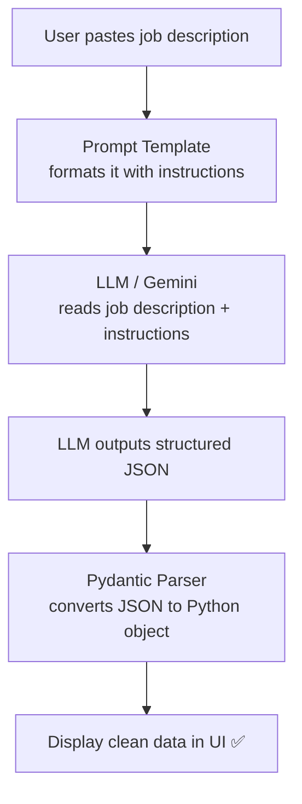

# JobSage — Notes

# ================

# What's in this folder:

# - core.py → CLI version: paste a job description, get structured output

# - UIcore.py → Streamlit web UI version

---

## What is JobSage?

JobSage is a mini AI project that reads a messy, unstructured job description and converts it into clean, structured data — automatically.

Instead of manually scanning a job post for skills, salary, and location, you paste it in and get:

```json
{
  "job_title": "Senior Machine Learning Engineer",
  "company_name": "DataVision AI",
  "location": "Berlin (Hybrid)",
  "job_type": "Full-time",
  "required_skills": ["Python", "PyTorch", "TensorFlow", "SQL", "Docker"],
  "nice_to_have_skills": ["LLMs", "LangChain", "MLflow"],
  "experience_required": "4+ years",
  "salary_range": "€80,000 – €110,000",
  "summary": "Senior ML engineering role at an AI company..."
}
```

This is a practical example of **structured output** — one of the most useful things you can do with an LLM in real business applications.

---

## Key Concepts

### 1. Structured Output — Making LLMs Fill in a Form

By default, an LLM gives you a free-form text response. But often you need a predictable, machine-readable output — like JSON. That's what structured output is.

Instead of: _"The job is for a Python developer at Google in London..."_

You get:

```json
{ "job_title": "Python Developer", "company": "Google", "location": "London" }
```

This is useful when:

- You want to store data in a database
- You want to display data in a UI with specific fields
- You're building a pipeline where the next step needs specific fields

---

### 2. Pydantic BaseModel — Defining the Structure

Pydantic is a Python library that lets you define the shape of your data as a class. Think of it as drawing the blank form:

```python
from pydantic import BaseModel, Field
from typing import List, Optional

class JobPosting(BaseModel):
    job_title: str                         # required — must always be there
    company_name: Optional[str]            # optional — might not be mentioned
    required_skills: List[str]             # a list — can have many items
    salary_range: Optional[str]            # optional field
```

- `str` = plain text
- `Optional[str]` = text or null (might not be present)
- `List[str]` = a list of text items

The `Field(description="...")` is how you tell the LLM what each field means.

---

### 3. PydanticOutputParser — Converting LLM Text to Python Object

The parser does two things:

1. **Before the call:** generates instructions that tell the LLM exactly what JSON to produce
2. **After the call:** takes the LLM's JSON text and converts it into a proper Python object

```python
parser = PydanticOutputParser(pydantic_object=JobPosting)

# Step 1: get the instructions to inject into the prompt
format_instructions = parser.get_format_instructions()

# Step 2: after calling the model, parse the response
job = parser.parse(response.content)

# Now you can access fields like a normal Python object
print(job.job_title)
print(job.required_skills)   # ['Python', 'TensorFlow', ...]
```

---

### 4. ChatPromptTemplate — Reusable Prompt with Variables

Instead of writing the same prompt string over and over, a template lets you define it once with `{placeholder}` slots and fill them in at runtime:

```python
from langchain_core.prompts import ChatPromptTemplate

prompt = ChatPromptTemplate.from_messages([
    ("system", "You are an expert recruiter. Extract job info.\n{format_instructions}"),
    ("human", "Job posting:\n{job_description}")
])

# Fill in the placeholders:
filled_prompt = prompt.invoke({
    "job_description": "We are hiring a Python developer...",
    "format_instructions": parser.get_format_instructions()
})

response = model.invoke(filled_prompt)
```

Templates make your code clean and reusable — change the job description, everything else stays the same.

---

### 5. Temperature = 0 for Structured Output

When extracting structured data, you want the model to be **precise** not creative. Setting `temperature=0` means:

- The model always picks the most likely/confident answer
- Same input almost always produces the same output
- Less hallucination (making things up)

```python
model = ChatGoogleGenerativeAI(model="gemini-1.5-flash", temperature=0)
```

Use `temperature=0` for: extraction, classification, code generation, fact retrieval.
Use higher temperature for: creative writing, brainstorming, storytelling.

---

## The Full Flow



---

## Extending JobSage — Ideas for Practice

Once you understand the pattern, try building:

| Project        | What to extract                                             |
| -------------- | ----------------------------------------------------------- |
| **CineSage**   | Movie info from Wikipedia paragraphs                        |
| **RecipeSage** | Ingredients, steps, time from any recipe text               |
| **EventSage**  | Event name, date, location, ticket info from event listings |
| **NewsSage**   | Headline, summary, sentiment from news articles             |
| **CVSage**     | Name, skills, experience from a CV/resume                   |

The pattern is always the same:

1. Define a Pydantic model with the fields you want
2. Create a parser and prompt template
3. Feed in the messy text
4. Get clean structured data out
