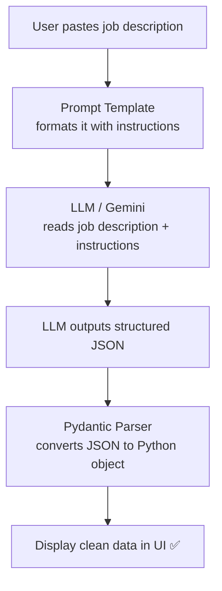
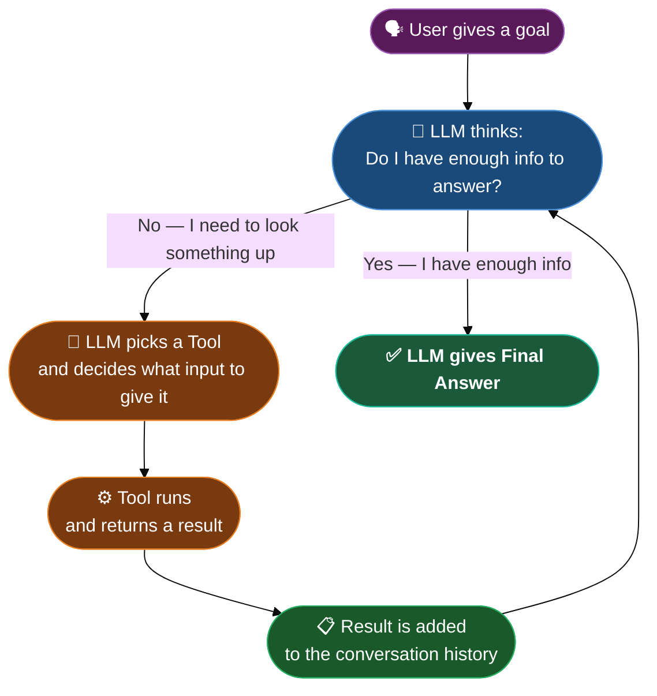
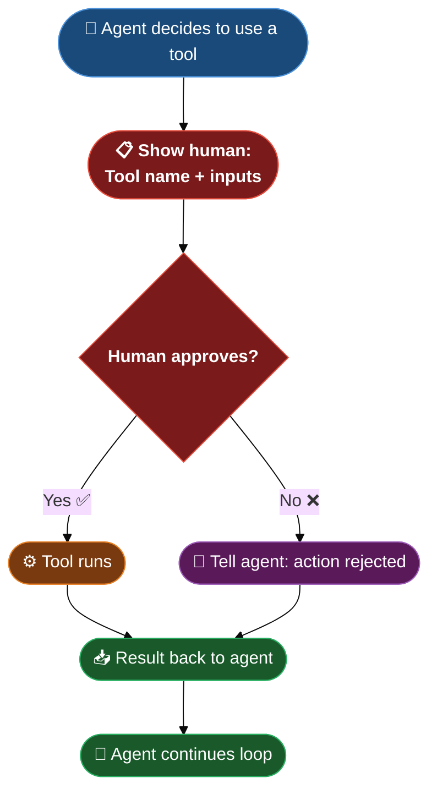
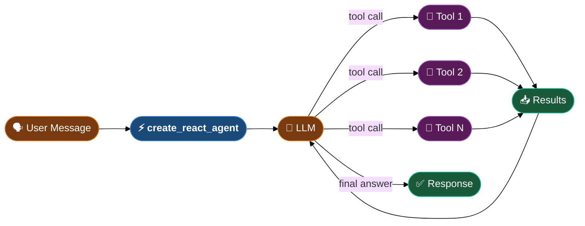
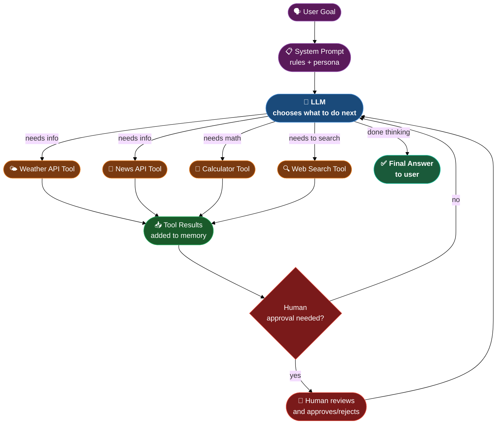

# JobSage — Notes

## What's in this folder

| File               | What it does                                                                      |
| ------------------ | --------------------------------------------------------------------------------- |
| `job_parser.py`    | Terminal version — paste a job description and get clean structured data back     |
| `job_parser_ui.py` | Browser version — same thing but with a proper web interface built with Streamlit |

---

## What is JobSage?

JobSage is a mini AI project that reads a messy, unstructured job description and converts it into clean, structured data — automatically.

Instead of manually scanning a job post for skills, salary, and location, you paste it in and get:

```json
{
  "job_title": "Senior Machine Learning Engineer",
  "company_name": "DataVision AI",
  "location": "Berlin (Hybrid)",
  "job_type": "Full-time",
  "required_skills": ["Python", "PyTorch", "TensorFlow", "SQL", "Docker"],
  "nice_to_have_skills": ["LLMs", "LangChain", "MLflow"],
  "experience_required": "4+ years",
  "salary_range": "€80,000 – €110,000",
  "summary": "Senior ML engineering role at an AI company..."
}
```

This is a practical example of **structured output** — one of the most useful things you can do with an LLM in real business applications.

---

## Key Concepts

### 1. Structured Output — Making LLMs Fill in a Form

By default, an LLM gives you a free-form text response. But often you need a predictable, machine-readable output — like JSON. That's what structured output is.

Instead of: _"The job is for a Python developer at Google in London..."_

You get:

```json
{ "job_title": "Python Developer", "company": "Google", "location": "London" }
```

This is useful when:

- You want to store data in a database
- You want to display data in a UI with specific fields
- You're building a pipeline where the next step needs specific fields

---

### 2. Pydantic BaseModel — Defining the Structure

Pydantic is a Python library that lets you define the shape of your data as a class. Think of it as drawing the blank form:

```python
from pydantic import BaseModel, Field
from typing import List, Optional

class JobPosting(BaseModel):
    job_title: str                         # required — must always be there
    company_name: Optional[str]            # optional — might not be mentioned
    required_skills: List[str]             # a list — can have many items
    salary_range: Optional[str]            # optional field
```

- `str` = plain text
- `Optional[str]` = text or null (might not be present)
- `List[str]` = a list of text items

The `Field(description="...")` is how you tell the LLM what each field means.

---

### 3. PydanticOutputParser — Converting LLM Text to Python Object

The parser does two things:

1. **Before the call:** generates instructions that tell the LLM exactly what JSON to produce
2. **After the call:** takes the LLM's JSON text and converts it into a proper Python object

```python
parser = PydanticOutputParser(pydantic_object=JobPosting)

# Step 1: get the instructions to inject into the prompt
format_instructions = parser.get_format_instructions()

# Step 2: after calling the model, parse the response
job = parser.parse(response.content)

# Now you can access fields like a normal Python object
print(job.job_title)
print(job.required_skills)   # ['Python', 'TensorFlow', ...]
```

---

### 4. ChatPromptTemplate — Reusable Prompt with Variables

Instead of writing the same prompt string over and over, a template lets you define it once with `{placeholder}` slots and fill them in at runtime:

```python
from langchain_core.prompts import ChatPromptTemplate

prompt = ChatPromptTemplate.from_messages([
    ("system", "You are an expert recruiter. Extract job info.\n{format_instructions}"),
    ("human", "Job posting:\n{job_description}")
])

# Fill in the placeholders:
filled_prompt = prompt.invoke({
    "job_description": "We are hiring a Python developer...",
    "format_instructions": parser.get_format_instructions()
})

response = model.invoke(filled_prompt)
```

Templates make your code clean and reusable — change the job description, everything else stays the same.

---

### 5. Temperature = 0 for Structured Output

When extracting structured data, you want the model to be **precise** not creative. Setting `temperature=0` means:

- The model always picks the most likely/confident answer
- Same input almost always produces the same output
- Less hallucination (making things up)

```python
model = ChatGoogleGenerativeAI(model="gemini-1.5-flash", temperature=0)
```

Use `temperature=0` for: extraction, classification, code generation, fact retrieval.
Use higher temperature for: creative writing, brainstorming, storytelling.

---

## The Full Flow



---

## Extending JobSage — Ideas for Practice

Once you understand the pattern, try building:

| Project        | What to extract                                             |
| -------------- | ----------------------------------------------------------- |
| **CineSage**   | Movie info from Wikipedia paragraphs                        |
| **RecipeSage** | Ingredients, steps, time from any recipe text               |
| **EventSage**  | Event name, date, location, ticket info from event listings |
| **NewsSage**   | Headline, summary, sentiment from news articles             |
| **CVSage**     | Name, skills, experience from a CV/resume                   |

The pattern is always the same:

1. Define a Pydantic model with the fields you want
2. Create a parser and prompt template
3. Feed in the messy text
4. Get clean structured data out

---

---

# Part 2 — AI Agents

> Everything above (JobSage) is a **pipeline** — the steps are fixed and the LLM has no choice.
> An **agent** is different. The LLM itself decides what to do next.

---

## 1. What is an AI Agent?

A normal LangChain chain looks like an assembly line. You wire the steps up yourself and every request follows the same path.

An **agent** is like an employee who can *think*. You give it a goal and a set of tools, and it figures out which tool to use, uses it, reads the result, and decides what to do next — all on its own.

```
You say:  "What's the weather in Tokyo, and what are today's top tech news headlines?"

Pipeline: ❌ would fail — no weather or news step was hard-coded
Agent:    ✅ calls weather tool → reads result → calls news tool → reads result → gives you a combined answer
```

The key difference:

| | Pipeline | Agent |
|---|---|---|
| Who decides the steps? | You (the developer) | The LLM itself |
| Steps are fixed? | Yes | No — it reasons each time |
| Can use tools? | Only if you wire them | Yes — picks the right one |
| Can handle unexpected inputs? | No | Yes |

Think of a **pipeline** as a vending machine (press B3, get a specific snack).
Think of an **agent** as a personal assistant (tell them your goal, they figure out how to do it).

---

## 2. What is a Tool?

A **tool** is a function the agent is allowed to call. It's how the agent interacts with the outside world.

Without tools, the LLM can only use knowledge it was trained on. With tools, it can:
- Look things up live (weather, news, stock prices)
- Do math precisely (instead of estimating)
- Search a database or vector store
- Run code
- Send emails or make API calls

```python
from langchain.tools import tool

@tool
def get_weather(city: str) -> str:
    """Get the current weather for a given city."""
    # call a real weather API here
    return f"It is 22°C and sunny in {city}."

@tool
def get_top_news(topic: str) -> str:
    """Get today's top news headlines for a given topic."""
    # call a real news API here
    return f"Top news for {topic}: ..."
```

The `@tool` decorator does two things:
1. Wraps your function so LangChain knows it's a tool
2. Uses the **docstring** as the description — this is what the LLM reads to decide whether to use this tool

> The docstring is critical. Write it in plain English describing exactly what the tool does and when to use it.

---

## 3. The Agent Loop — How an Agent Actually Thinks

This is the core of every agent. It runs over and over until the agent has a final answer:



**Step by step:**

1. **User gives a goal** — "Find the weather in Paris and tell me if I should bring an umbrella"
2. **LLM thinks** — "I don't know the current weather. I should use the weather tool."
3. **LLM calls the tool** — it outputs `{"tool": "get_weather", "input": "Paris"}`
4. **Tool runs** — returns `"It is 14°C and rainy in Paris."`
5. **Result goes back to the LLM** — now it knows the weather
6. **LLM thinks again** — "I have the answer. Rainy → yes, bring an umbrella."
7. **LLM gives final answer** — "It's rainy in Paris today — definitely bring an umbrella!"

The loop keeps repeating until the LLM is satisfied it can answer without more tools.

---

## 4. Building a Manual Agent from Scratch

Before using LangChain's built-in agent helpers, it's valuable to build one manually — this shows you exactly what's happening under the hood.

```python
from langchain_mistralai import ChatMistralAI
from langchain_core.messages import HumanMessage, AIMessage, ToolMessage

model = ChatMistralAI(model="mistral-small-2506")

# Bind tools to the model — now it knows these tools exist
model_with_tools = model.bind_tools([get_weather, get_top_news])

# Start conversation
messages = [HumanMessage("What's the weather in Tokyo?")]

# --- AGENT LOOP ---
while True:
    response = model_with_tools.invoke(messages)
    messages.append(response)

    # If the LLM called a tool...
    if response.tool_calls:
        for tool_call in response.tool_calls:
            tool_name   = tool_call["name"]
            tool_input  = tool_call["args"]

            # Find the right tool and run it
            tool_result = {
                "get_weather":  get_weather,
                "get_top_news": get_top_news,
            }[tool_name].invoke(tool_input)

            # Add the tool's result back to the conversation
            messages.append(ToolMessage(
                content=str(tool_result),
                tool_call_id=tool_call["id"]
            ))
    else:
        # No tool calls = LLM has a final answer
        print(response.content)
        break
```

**What's happening:**
- `bind_tools()` tells the model which tools are available and what they do
- Every tool result gets added to `messages` — this is the agent's memory
- The loop keeps running until the LLM stops calling tools and gives a plain text answer

---

## 5. How the LLM Decides Which Tool to Use

The LLM never sees your Python code. It only sees the **tool name** and **docstring** (description). That's how it decides.

```
User question: "What is 15% of 340?"

Tool A — get_weather:  "Get the current weather for a given city."     ← not relevant
Tool B — calculator:   "Perform arithmetic calculations."               ← pick this one!
Tool C — search_web:   "Search the internet for any topic."            ← might work but calculator is better
```

The LLM reads the descriptions and picks the best match for the current situation. This is why writing clear, specific docstrings is so important.

```
❌ Bad docstring:  "Does stuff with numbers"
✅ Good docstring: "Multiply, divide, add, or subtract numbers. Use this for any math calculation."
```

Internally, the model outputs something like:

```json
{
  "tool": "calculator",
  "input": { "expression": "340 * 0.15" }
}
```

LangChain reads this, runs the tool, and feeds the result back.

---

## 6. Integrating Real-World APIs — Weather and News

Here's how you'd wire in actual live APIs:

### Weather — OpenWeatherMap API

```python
import requests
from langchain.tools import tool

@tool
def get_weather(city: str) -> str:
    """Get the current real-time weather for any city in the world."""
    api_key = "your_openweathermap_api_key"
    url = f"http://api.openweathermap.org/data/2.5/weather?q={city}&appid={api_key}&units=metric"
    data = requests.get(url).json()
    temp        = data["main"]["temp"]
    description = data["weather"][0]["description"]
    return f"{city}: {temp}°C, {description}"
```

### News — NewsAPI

```python
@tool
def get_top_news(topic: str) -> str:
    """Get today's top news headlines for any topic or keyword."""
    api_key = "your_newsapi_key"
    url = f"https://newsapi.org/v2/everything?q={topic}&sortBy=publishedAt&apiKey={api_key}"
    articles = requests.get(url).json()["articles"][:3]
    return "\n".join([f"- {a['title']}" for a in articles])
```

Now passing these tools to the agent gives it real, live information — not just what it was trained on.

```
User: "Tell me the weather in London and the latest AI news"

Agent:
  Step 1 → calls get_weather("London")     → "London: 11°C, light rain"
  Step 2 → calls get_top_news("AI")        → "- OpenAI releases GPT-5..."
  Step 3 → Final answer: "It's 11°C and rainy in London. In AI news today: ..."
```

---

## 7. Human-in-the-Loop — Adding a Safety Check

By default, agents run fully autonomously. For anything that has real-world consequences (sending emails, making purchases, deleting files), you want a human to approve each action before it runs.

```python
@tool
def send_email(to: str, subject: str, body: str) -> str:
    """Send an email to the specified address."""
    # This could send a real email — dangerous if agent hallucinates!
    pass

# ---- Human approval gate ----
def run_agent_with_approval(user_input: str):
    messages = [HumanMessage(user_input)]

    while True:
        response = model_with_tools.invoke(messages)
        messages.append(response)

        if response.tool_calls:
            for tool_call in response.tool_calls:
                print(f"\n⚠️  Agent wants to run: {tool_call['name']}")
                print(f"   With input: {tool_call['args']}")

                # Ask human before running
                approval = input("Approve? (yes/no): ").strip().lower()

                if approval == "yes":
                    result = available_tools[tool_call["name"]].invoke(tool_call["args"])
                else:
                    result = "Action was rejected by the user."

                messages.append(ToolMessage(
                    content=str(result),
                    tool_call_id=tool_call["id"]
                ))
        else:
            print(response.content)
            break
```

**Why this matters:**
- Agents can hallucinate tool inputs (wrong email address, wrong amount)
- Some actions can't be undone
- In production systems, human approval is a safety net



---

## 8. create_react_agent — LangChain's Built-in Agent

Once you understand the manual loop, LangChain gives you a shortcut that does all of it for you: `create_react_agent`.

**ReAct** stands for **Reason + Act** — the agent alternates between reasoning (thinking) and acting (using tools).

```python
from langgraph.prebuilt import create_react_agent

# One line replaces your entire manual loop
agent = create_react_agent(
    model=model,
    tools=[get_weather, get_top_news, calculator]
)

# Run it
result = agent.invoke({
    "messages": [HumanMessage("What's the weather in Berlin and top AI news today?")]
})

print(result["messages"][-1].content)
```

**What it handles automatically:**
- The `while True` loop
- Routing tool calls back to the right function
- Collecting all results
- Formatting the final answer



The difference between manual agent and `create_react_agent`:

| | Manual Agent | create_react_agent |
|---|---|---|
| Loop logic | You write it | Built-in |
| Tool routing | You write it | Built-in |
| Good for | Learning, custom control | Production, quick setup |
| Human-in-loop | Easy to add | Needs extra config |

---

## 9. Debugging and Controlling Agent Behavior

Agents can be unpredictable. Here's how to understand and control what's happening:

### See Every Step with verbose=True

```python
agent = create_react_agent(model=model, tools=tools)

# Use stream() to see each step as it happens
for step in agent.stream({"messages": [HumanMessage("What is 55 * 23?")]}):
    print(step)
```

### Limit How Many Steps the Agent Can Take

An agent stuck in a loop will keep running forever. Set a max:

```python
agent = create_react_agent(
    model=model,
    tools=tools,
    checkpointer=None
)

# Limit iterations in the config
result = agent.invoke(
    {"messages": [HumanMessage("research everything about quantum physics")]},
    config={"recursion_limit": 5}   # stop after 5 loops max
)
```

### Give the Agent a System Prompt (Persona + Rules)

```python
from langchain_core.messages import SystemMessage

result = agent.invoke({
    "messages": [
        SystemMessage("You are a helpful assistant. Always be concise. Never make up facts — if you don't know, say so."),
        HumanMessage("What's the weather in Mumbai?")
    ]
})
```

### Common Things That Go Wrong

| Problem | Cause | Fix |
|---|---|---|
| Agent loops forever | Model can't decide / bad tool descriptions | Set `recursion_limit`, improve docstrings |
| Agent uses wrong tool | Docstrings are vague | Rewrite docstrings to be more specific |
| Agent hallucinates tool inputs | Not enough context | Add more detail to system prompt |
| Agent ignores a tool | Docstring doesn't match the question | Use clearer, more specific language |

---

## The Full Agent Picture



---

## Quick Reference

| Concept | What it is | When you use it |
|---|---|---|
| **Agent** | LLM that decides its own steps | When the task isn't predictable |
| **Tool** | A function the agent can call | Any time you need live data or actions |
| **Agent loop** | LLM → Tool → Result → repeat | Happens automatically inside the agent |
| **bind_tools()** | Tells the model which tools exist | Before running any agent |
| **ToolMessage** | Tool result fed back to LLM | In the manual agent loop |
| **create_react_agent** | LangChain's built-in agent runner | Quick setup in production |
| **Human-in-the-loop** | Human approves before tool runs | For irreversible or risky actions |
| **recursion_limit** | Max number of agent steps | To prevent infinite loops |
| **System prompt** | Rules and persona for the agent | Always — controls agent behaviour |
