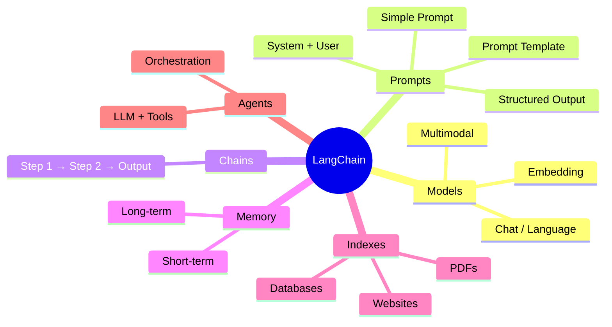
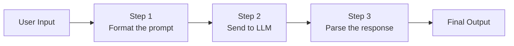
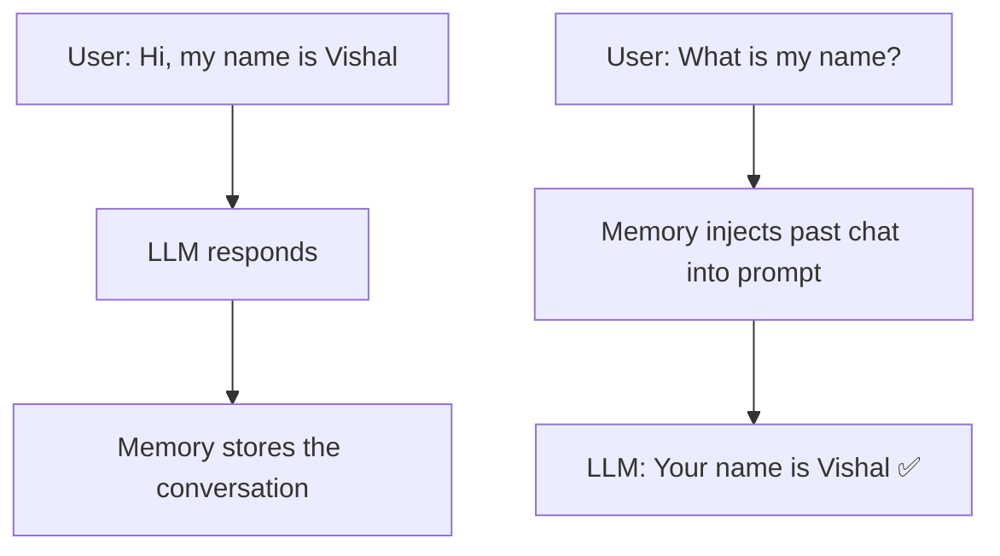
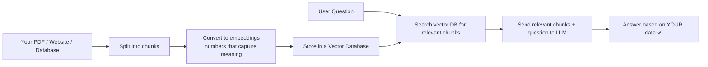
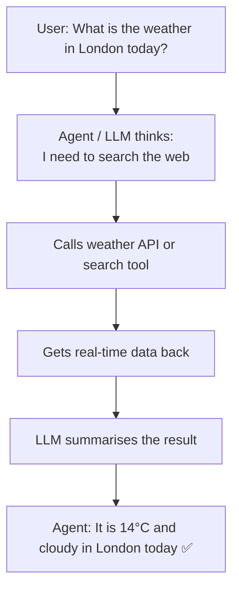

# Artificial Intelligence

## What is an LLM (Large Language Model)?

An LLM is an AI system that can read, write, and understand text — almost like talking to a very well-read person who has consumed an enormous amount of written content.

The name breaks down into three simple words:

---

### Large

It has been trained on a **huge** amount of text data — we're talking billions of pages worth of:

- Books
- Websites
- Wikipedia articles
- News articles
- Code
- Conversations

The "large" part refers to both the sheer size of the training data and the number of parameters (internal settings) the model has — often in the billions.

---

### Language

It understands a **wide variety of languages** — not just English, but:

- French, Spanish, Hindi, and dozens of other spoken languages
- Programming languages like Python, JavaScript, SQL, and more

This is why you can ask it questions in your native language or ask it to write code, and it handles both.

---

### Model

It is a **deep learning system** — a type of neural network (inspired loosely by how the human brain works) that has learned patterns from all that data.

During training, it saw countless sentences and learned: _"after this word, what word usually comes next?"_ — over and over, billions of times.

---

## How Does It Actually Work?

At its core, the process is surprisingly simple:

1. You give it some text (a question, a sentence, a prompt)
2. It looks at what you wrote and all the patterns it learned during training
3. It **predicts the next most likely word**
4. Then it predicts the word after that
5. And the word after that...
6. It keeps going, word by word, until it has a complete response

That's it. One word at a time, each word chosen based on what makes the most sense given everything before it.

> Think of it like a very sophisticated autocomplete — except instead of suggesting the next word in a text message, it can write entire essays, answer complex questions, explain code, and hold a conversation.

---

## The Problem with Using LLMs Directly

Every major company — OpenAI, Anthropic, Google, Meta — offers their own LLM through an API. The problem? **They all work differently.**

Each one has its own:

- Code style and SDK
- Library to install
- Way to send messages and read responses

So if you build an app using OpenAI and then want to switch to Anthropic, you'd have to **rewrite a large chunk of your code**. That's painful, especially as your app grows.

```
┌─────────────┐    ┌─────────────┐    ┌─────────────┐
│   OpenAI    │    │  Anthropic  │    │   Google    │
│  (GPT-4)   │    │  (Claude)   │    │  (Gemini)   │
└──────┬──────┘    └──────┬──────┘    └──────┬──────┘
       │                  │                  │
  different SDK      different SDK      different SDK
       │                  │                  │
       └──────────────────┴──────────────────┘
                          │
               😫 Every switch = rewrite code
```

---

## The Solution — LangChain

**LangChain** is a framework that acts as a universal adapter between your app and any LLM provider. You write your code once using LangChain, and you can swap the underlying model without rewriting everything.

```
┌──────────────────────────────────────────────┐
│                  Your App                    │
└───────────────────────┬──────────────────────┘
                        │
                        ▼
┌──────────────────────────────────────────────┐
│                  LangChain                   │
│         (one standard way to talk)           │
└──────┬───────────┬───────────┬───────────────┘
       │           │           │
       ▼           ▼           ▼
   OpenAI     Anthropic     Google
   GPT-4       Claude       Gemini
```

LangChain organises everything into **6 building blocks** that cover everything you need to build a proper AI application.

---

## LangChain's 6 Components



---

### 1. Models — The Brain

Models are the **core intelligence layer**. They are what actually generate text, understand your question, and produce an answer. LangChain lets you connect to any model through one consistent interface.

There are three types:

| Type                      | What It Does                              | Example Use                    |
| ------------------------- | ----------------------------------------- | ------------------------------ |
| **Chat / Language Model** | Generates text — answers, summaries, code | ChatGPT, Claude                |
| **Embedding Model**       | Converts text into numbers (vectors)      | Searching documents by meaning |
| **Multimodal Model**      | Works with images, audio, and files too   | GPT-4o with image input        |

> Think of the model as the engine inside a car. LangChain is the steering wheel — you control any engine with the same wheel.

---

### 2. Prompts — The Instructions

A prompt is the **instruction you give to the model** — it tells the model what to do, how to behave, and what format to respond in. The quality of your prompt directly determines the quality of the output.

There are a few types:

- **Simple prompt** — just a plain question or instruction
- **System + User prompt** — you first set the model's personality ("You are a helpful AI teacher"), then ask your question
- **Prompt template** — a reusable fill-in-the-blank template so you don't rewrite the same prompt every time
- **Structured prompt** — tells the model to respond in a specific format like JSON

```
System:  "You are a helpful AI teacher who explains things simply."
          ↓
User:    "Explain what an embedding is."
          ↓
Model:   "An embedding is like giving every word a home on a map..."
```

---

### 3. Chains — Connecting Steps Together

A chain is when you **link multiple steps in a sequence** so the output of one step becomes the input of the next. This lets you build multi-step workflows.



**Example chain:**

1. Take a user's raw question
2. Format it using a prompt template
3. Send it to the model
4. Extract only the relevant part of the answer
5. Return a clean response

Without chains, you'd have to wire all these steps manually every time.

---

### 4. Memory — Remembering the Conversation

By default, an LLM has **no memory**. Every message you send is treated as if it's the first time you've ever spoken. That's why ChatGPT sometimes forgets what you said two messages ago if the conversation gets long.

LangChain's memory component fixes this — it stores past messages and feeds them back into the prompt so the model has context.



**Without memory:**

- Message 1: "My name is Vishal"
- Message 2: "What is my name?" → LLM: "I don't know your name" ❌

**With memory:**

- Message 1: "My name is Vishal" → stored
- Message 2: "What is my name?" → LLM sees the full history → "Your name is Vishal" ✅

---

### 5. Indexes — Connecting Your Own Data

LLMs only know what they were trained on — they have no idea about your company's internal documents, your PDF reports, or your private database.

**Indexes** solve this by letting you connect external data sources to the LLM, so it can answer questions based on your own content.



> This is the foundation of **RAG (Retrieval-Augmented Generation)** — instead of the LLM guessing, it looks up the right information first and then answers.

---

### 6. Agents — LLMs That Can Take Action

An agent is an **LLM that can use tools** to get things done. Instead of just generating text, it can:

- Search the web
- Run code
- Read a file
- Call an API
- Use other LLMs

The LLM acts as the brain that decides **which tool to use and when**, then loops until the task is complete.



**The formula:**

```
Agent = LLM + Tools + Loop
```

Multiple agents can also be chained together, where one agent orchestrates others — this is called an **agentic system** or multi-agent architecture.
