# Artificial Intelligence

## Table of Contents

1. [What is Generative AI?](#what-is-generative-ai)
2. [Where Does It Fit in the AI Landscape?](#where-does-it-fit-in-the-ai-landscape)
3. [Prerequisites — What You Need to Know First](#prerequisites--what-you-need-to-know-first)
4. [Learning Roadmap](#learning-roadmap)
5. [What is an LLM?](#what-is-an-llm-large-language-model)
6. [How Does It Actually Work?](#how-does-it-actually-work)
7. [What LLMs Can and Cannot Do](#what-llms-can-and-cannot-do)
8. [Popular LLMs](#popular-llms)
9. [Using LLMs via APIs](#using-llms-via-apis)
10. [The Problem with Using LLMs Directly](#the-problem-with-using-llms-directly)
11. [The Solution — LangChain](#the-solution--langchain)
12. [LangChain's 6 Components](#langchains-6-components)
    - [1. Models](#1-models--the-brain)
    - [2. Prompts](#2-prompts--the-instructions)
    - [3. Chains](#3-chains--connecting-steps-together)
    - [4. Memory](#4-memory--remembering-the-conversation)
    - [5. Indexes](#5-indexes--connecting-your-own-data)
    - [6. Agents](#6-agents--llms-that-can-take-action)
13. [Using Different Models in LangChain](#using-different-models-in-langchain)
14. [Free vs Paid Models — Which Should You Use?](#free-vs-paid-models--which-should-you-use)
15. [Message Types — The Building Blocks of a Conversation](#message-types--the-building-blocks-of-a-conversation)
16. [Memory Types — A Deeper Look](#memory-types--a-deeper-look)
17. [Putting It All Together — The Big Picture](#putting-it-all-together--the-big-picture)

---

## What is Generative AI?

Generative AI is the branch of AI that **creates new content** — text, images, audio, video, code — rather than just classifying or analysing existing content.

Before generative AI, most AI systems were built to do one narrow thing:

- Is this email spam or not?
- Is this image a cat or a dog?
- Will this customer churn?

Generative AI changed the game. A single model can now **write a story, generate code, summarise a document, answer a question, and translate text** — all in one go.

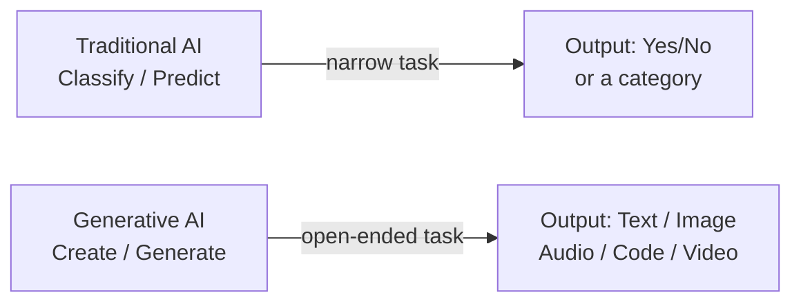

> The key shift: instead of building a narrowly trained model for every task, you tap into one massive pre-trained model and tell it what you need.

---

## Where Does It Fit in the AI Landscape?

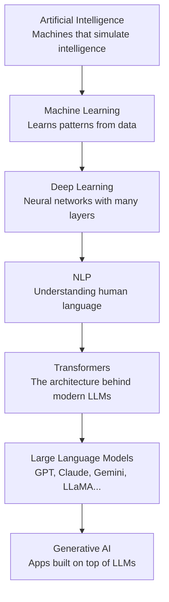

Each layer builds on the one below it. Generative AI sits at the top — it is the **application layer** that most developers and businesses interact with today.

---

## Prerequisites — What You Need to Know First

Before diving deep into building AI applications, it helps to have a basic understanding of these areas. You don't need to be an expert — a working knowledge of each is enough.

| Prerequisite         | Why It Matters                        | Minimum You Need                         |
| -------------------- | ------------------------------------- | ---------------------------------------- |
| **Python**           | Every AI framework uses Python        | Variables, functions, loops, pip install |
| **Machine Learning** | Understand how models learn from data | Train/test split, loss, overfitting      |
| **Deep Learning**    | LLMs are deep neural networks         | Layers, weights, backpropagation         |
| **Transformers**     | The architecture all modern LLMs use  | Self-attention, encoder, decoder         |
| **NLP**              | LLMs work with language               | Tokenisation, embeddings, context        |

> Don't worry if you haven't mastered all of these. You can learn them alongside the AI application work — they will make more sense once you have real context.

---

## Learning Roadmap

Here's a practical plan to go from zero to building real AI applications:

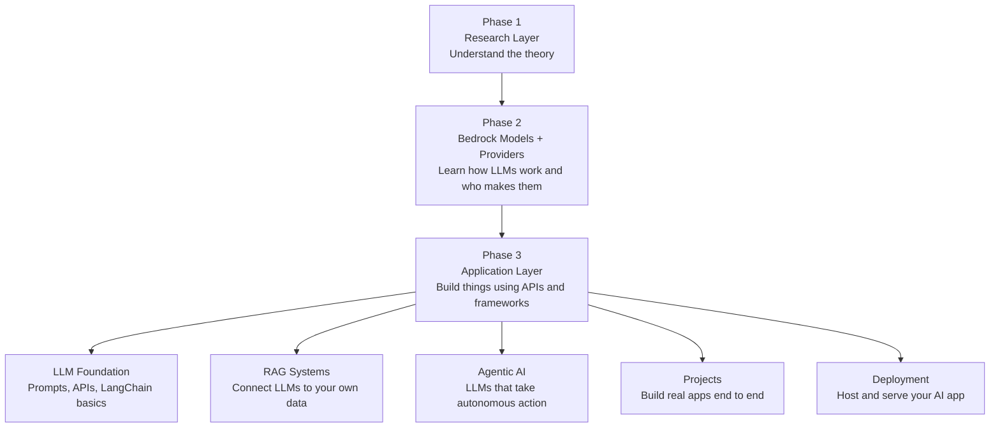

**Phase 1 — Research Layer:** Understand what AI, LLMs, and generative AI actually are (this document covers this).

**Phase 2 — Bedrock Models + Providers:** Learn which companies make which models, what their strengths are, and how to access them via API.

**Phase 3 — Application Layer:** This is where you build. The five sub-tracks are:

- **LLM Foundation** — prompts, API calls, LangChain
- **RAG Systems** — connect LLMs to PDFs, databases, websites
- **Agentic AI** — build agents that take autonomous actions
- **Projects** — real apps combining all of the above
- **Deployment** — host your app on the cloud so others can use it

---

## What is an LLM (Large Language Model)?

An LLM is an AI system that can read, write, and understand text — almost like talking to a very well-read person who has consumed an enormous amount of written content.

The name breaks down into three simple words:

---

### Large

It has been trained on a **huge** amount of text data — we're talking billions of pages worth of:

- Books
- Websites
- Wikipedia articles
- News articles
- Code
- Conversations

The "large" part refers to both the sheer size of the training data and the number of parameters (internal settings) the model has — often in the billions.

---

### Language

It understands a **wide variety of languages** — not just English, but:

- French, Spanish, Hindi, and dozens of other spoken languages
- Programming languages like Python, JavaScript, SQL, and more

This is why you can ask it questions in your native language or ask it to write code, and it handles both.

---

### Model

It is a **deep learning system** — a type of neural network (inspired loosely by how the human brain works) that has learned patterns from all that data.

During training, it saw countless sentences and learned: _"after this word, what word usually comes next?"_ — over and over, billions of times.

---

## How Does It Actually Work?

At its core, the process is surprisingly simple:

1. You give it some text (a question, a sentence, a prompt)
2. It looks at what you wrote and all the patterns it learned during training
3. It **predicts the next most likely word**
4. Then it predicts the word after that
5. And the word after that...
6. It keeps going, word by word, until it has a complete response

That's it. One word at a time, each word chosen based on what makes the most sense given everything before it.

> Think of it like a very sophisticated autocomplete — except instead of suggesting the next word in a text message, it can write entire essays, answer complex questions, explain code, and hold a conversation.

---

## The Problem with Using LLMs Directly

Every major company — OpenAI, Anthropic, Google, Meta — offers their own LLM through an API. The problem? **They all work differently.**

Each one has its own:

- Code style and SDK
- Library to install
- Way to send messages and read responses

So if you build an app using OpenAI and then want to switch to Anthropic, you'd have to **rewrite a large chunk of your code**. That's painful, especially as your app grows.

```
┌─────────────┐    ┌─────────────┐    ┌─────────────┐
│   OpenAI    │    │  Anthropic  │    │   Google    │
│  (GPT-4)   │    │  (Claude)   │    │  (Gemini)   │
└──────┬──────┘    └──────┬──────┘    └──────┬──────┘
       │                  │                  │
  different SDK      different SDK      different SDK
       │                  │                  │
       └──────────────────┴──────────────────┘
                          │
               😫 Every switch = rewrite code
```

---

## The Solution — LangChain

**LangChain** is a framework that acts as a universal adapter between your app and any LLM provider. You write your code once using LangChain, and you can swap the underlying model without rewriting everything.

```
┌──────────────────────────────────────────────┐
│                  Your App                    │
└───────────────────────┬──────────────────────┘
                        │
                        ▼
┌──────────────────────────────────────────────┐
│                  LangChain                   │
│         (one standard way to talk)           │
└──────┬───────────┬───────────┬───────────────┘
       │           │           │
       ▼           ▼           ▼
   OpenAI     Anthropic     Google
   GPT-4       Claude       Gemini
```

LangChain organises everything into **6 building blocks** that cover everything you need to build a proper AI application.

---

## LangChain's 6 Components

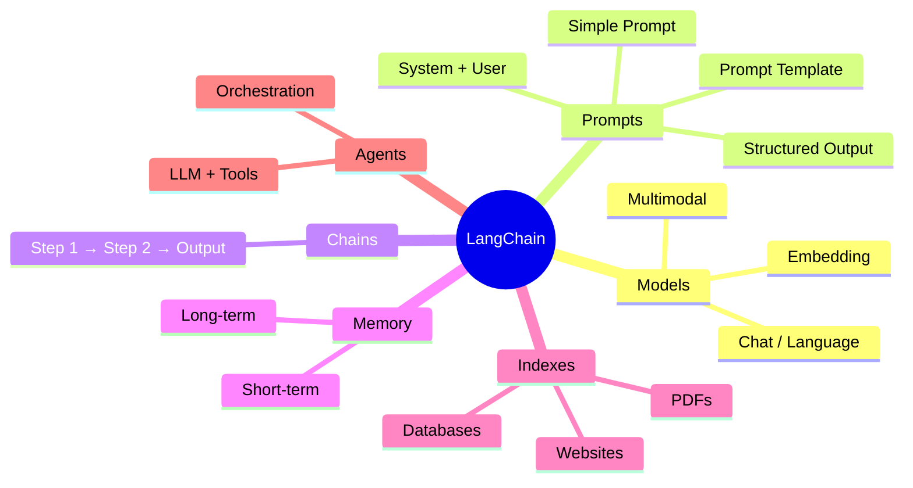

---

### 1. Models — The Brain

Models are the **core intelligence layer**. They are what actually generate text, understand your question, and produce an answer. LangChain lets you connect to any model through one consistent interface.

There are three types:

| Type                      | What It Does                              | Example Use                    |
| ------------------------- | ----------------------------------------- | ------------------------------ |
| **Chat / Language Model** | Generates text — answers, summaries, code | ChatGPT, Claude                |
| **Embedding Model**       | Converts text into numbers (vectors)      | Searching documents by meaning |
| **Multimodal Model**      | Works with images, audio, and files too   | GPT-4o with image input        |

> Think of the model as the engine inside a car. LangChain is the steering wheel — you control any engine with the same wheel.

---

### 2. Prompts — The Instructions

A prompt is the **instruction you give to the model** — it tells the model what to do, how to behave, and what format to respond in. The quality of your prompt directly determines the quality of the output.

There are a few types:

- **Simple prompt** — just a plain question or instruction
- **System + User prompt** — you first set the model's personality ("You are a helpful AI teacher"), then ask your question
- **Prompt template** — a reusable fill-in-the-blank template so you don't rewrite the same prompt every time
- **Structured prompt** — tells the model to respond in a specific format like JSON

```
System:  "You are a helpful AI teacher who explains things simply."
          ↓
User:    "Explain what an embedding is."
          ↓
Model:   "An embedding is like giving every word a home on a map..."
```

---

### 3. Chains — Connecting Steps Together

A chain is when you **link multiple steps in a sequence** so the output of one step becomes the input of the next. This lets you build multi-step workflows.

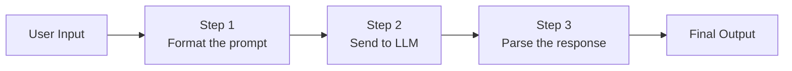

**Example chain:**

1. Take a user's raw question
2. Format it using a prompt template
3. Send it to the model
4. Extract only the relevant part of the answer
5. Return a clean response

Without chains, you'd have to wire all these steps manually every time.

---

### 4. Memory — Remembering the Conversation

By default, an LLM has **no memory**. Every message you send is treated as if it's the first time you've ever spoken. That's why ChatGPT sometimes forgets what you said two messages ago if the conversation gets long.

LangChain's memory component fixes this — it stores past messages and feeds them back into the prompt so the model has context.

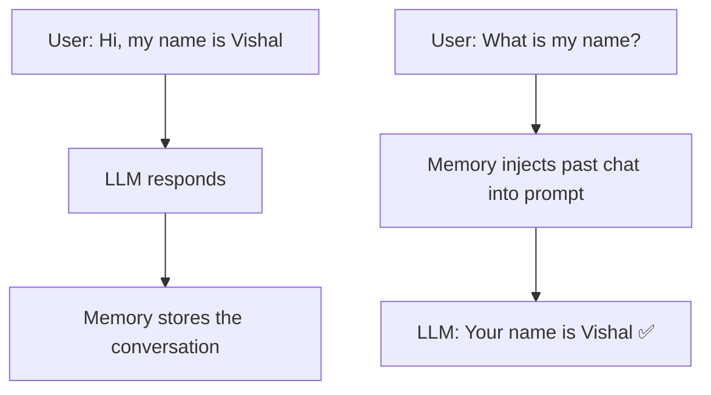

**Without memory:**

- Message 1: "My name is Vishal"
- Message 2: "What is my name?" → LLM: "I don't know your name" ❌

**With memory:**

- Message 1: "My name is Vishal" → stored
- Message 2: "What is my name?" → LLM sees the full history → "Your name is Vishal" ✅

---

### 5. Indexes — Connecting Your Own Data

LLMs only know what they were trained on — they have no idea about your company's internal documents, your PDF reports, or your private database.

**Indexes** solve this by letting you connect external data sources to the LLM, so it can answer questions based on your own content.

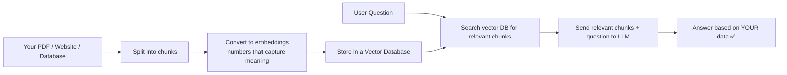

> This is the foundation of **RAG (Retrieval-Augmented Generation)** — instead of the LLM guessing, it looks up the right information first and then answers.

---

### 6. Agents — LLMs That Can Take Action

An agent is an **LLM that can use tools** to get things done. Instead of just generating text, it can:

- Search the web
- Run code
- Read a file
- Call an API
- Use other LLMs

The LLM acts as the brain that decides **which tool to use and when**, then loops until the task is complete.

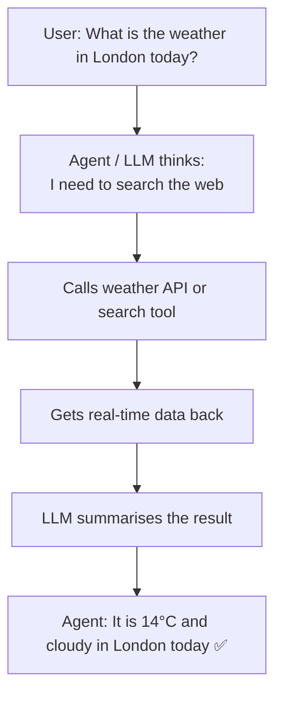

**The formula:**

```
Agent = LLM + Tools + Loop
```

Multiple agents can also be chained together, where one agent orchestrates others — this is called an **agentic system** or multi-agent architecture.

---

## What LLMs Can and Cannot Do

This is one of the most important things to understand early on. A lot of the confusion about AI comes from people either **over-estimating** or **under-estimating** what LLMs actually do.

### What an LLM CAN Do

| Capability                  | Example                                                |
| --------------------------- | ------------------------------------------------------ |
| Generate fluent text        | Write an essay, email, story                           |
| Answer knowledge questions  | "What is the capital of France?"                       |
| Summarise long documents    | Paste a 10-page PDF, get a 5-bullet summary            |
| Write and explain code      | "Write a Python function to sort a list"               |
| Translate between languages | English → Spanish, Python → JavaScript                 |
| Follow instructions         | "Respond only in JSON", "Be formal"                    |
| Hold a conversation         | Chat back and forth with context (when memory is used) |

### What an LLM CANNOT Do (by default)

| Limitation                    | Why                                                                 |
| ----------------------------- | ------------------------------------------------------------------- |
| Search the web in real time   | It has no internet connection — it only knows its training data     |
| Access your private files     | It has no access to your computer or database                       |
| Know today's date or news     | Its knowledge has a cut-off date                                    |
| "Think" like a human          | It predicts the most statistically likely next word — not reasoning |
| Remember past conversations   | Each new session starts fresh unless memory is added                |
| Perform calculations reliably | It guesses numbers based on patterns, not actual arithmetic         |

```
❌ What people think an LLM does:
   User asks → LLM searches Google → LLM thinks → LLM answers

✅ What an LLM actually does:
   User asks → LLM looks at the question + its training patterns
              → predicts the most likely words to form an answer
              → outputs them one by one
```

> This is why LLMs sometimes confidently say wrong things — they don't know they're wrong. They are just producing the most statistically probable response.

---

## Popular LLMs

Several companies have built and released powerful LLMs. Here's a quick overview of the main ones:

| Model              | Company         | Key Trait                                                 |
| ------------------ | --------------- | --------------------------------------------------------- |
| **GPT-4 / GPT-4o** | OpenAI          | The most widely used, strong all-rounder                  |
| **Gemini**         | Google          | Deep integration with Google services and search          |
| **Claude**         | Anthropic       | Very long context window, known for being safety-focused  |
| **LLaMA**          | Meta            | Open-source — you can download and run it yourself        |
| **Mistral**        | Mistral AI      | Lightweight, efficient, open-source European alternative  |
| **Grok**           | xAI (Elon Musk) | Integrated with X (Twitter), real-time data access        |
| **Copilot**        | Microsoft       | Built on GPT-4, integrated deeply into Microsoft products |

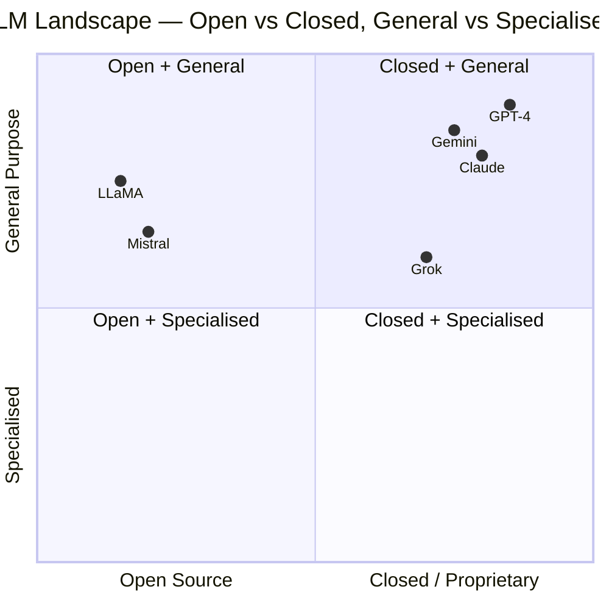

> **For building apps:** You'll mostly use GPT-4, Claude, or Gemini through their APIs. For running locally or keeping data private, LLaMA and Mistral are popular choices.

---

## Using LLMs via APIs

You don't download an LLM onto your laptop. Instead, you talk to it over the internet through an **API (Application Programming Interface)** — like sending a message and getting a reply.

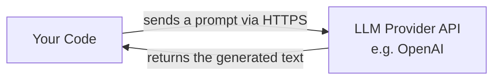

The basic flow is always:

1. Sign up with the provider and get an **API key** (like a password)
2. Install their SDK (e.g. `pip install openai`)
3. Write code to send a prompt and receive the response
4. Use the response in your app

**The problem** — every provider does this differently:

```python
# OpenAI style
from openai import OpenAI
client = OpenAI(api_key="...")
response = client.chat.completions.create(
    model="gpt-4",
    messages=[{"role": "user", "content": "Hello!"}]
)
print(response.choices[0].message.content)

# Anthropic style — completely different
import anthropic
client = anthropic.Anthropic(api_key="...")
message = client.messages.create(
    model="claude-3-opus-20240229",
    max_tokens=1024,
    messages=[{"role": "user", "content": "Hello!"}]
)
print(message.content[0].text)
```

Same task. Completely different code. That's the problem LangChain solves.

---

## Using Different Models in LangChain

LangChain's biggest win is that you can **swap the model with one line of code** while the rest of your application stays exactly the same.

```python
# Using OpenAI
from langchain_openai import ChatOpenAI
llm = ChatOpenAI(model="gpt-4", api_key="...")

# Switching to Anthropic Claude — everything else stays the same
from langchain_anthropic import ChatAnthropic
llm = ChatAnthropic(model="claude-3-opus-20240229", api_key="...")

# Switching to Google Gemini — still the same
from langchain_google_genai import ChatGoogleGenerativeAI
llm = ChatGoogleGenerativeAI(model="gemini-pro", api_key="...")

# The rest of your code never changes:
response = llm.invoke("Explain what an LLM is in one sentence.")
print(response.content)
```

This is why LangChain matters. You can **start with OpenAI**, then switch to a cheaper or faster model later without touching anything else.

### Embedding Models in LangChain

Embedding models are used differently — they convert text into a list of numbers (a vector) that captures the meaning of the text.

```python
from langchain_openai import OpenAIEmbeddings

embeddings = OpenAIEmbeddings()
vector = embeddings.embed_query("What is a transformer?")
# Returns something like: [0.021, -0.034, 0.098, 0.003, ...] (1536 numbers)
```

These vectors are used in **similarity search** — to find which documents are most relevant to a question. This is core to how RAG works.

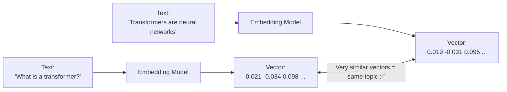

---

## Free vs Paid Models — Which Should You Use?

When you're learning or building an AI app, one of the first practical questions is: **do I have to pay to use an LLM?** The answer is — it depends on which model you choose.

There are three main categories:

```
┌─────────────────────────────────────────────────────────────┐
│                      LLM Options                            │
├─────────────────┬───────────────────┬───────────────────────┤
│   Paid APIs     │   Free-tier APIs  │   Run Locally (Free)  │
│ (OpenAI, etc.)  │ (Google, etc.)    │ (Ollama + LLaMA etc.) │
├─────────────────┴───────────────────┴───────────────────────┤
│  Best quality   │ Good for learning │ 100% free, no limits  │
│  Costs money    │ Limited monthly   │ Needs a decent PC     │
└─────────────────────────────────────────────────────────────┘
```

---

### Paid API Models

These are the most capable models. You pay per **token** (roughly 1 token ≈ ¾ of a word).

| Provider      | Model             | Cost (approx)              | Notes                           |
| ------------- | ----------------- | -------------------------- | ------------------------------- |
| **OpenAI**    | GPT-4o            | ~$5 per 1M input tokens    | Most popular, great all-rounder |
| **OpenAI**    | GPT-3.5-turbo     | ~$0.50 per 1M input tokens | Much cheaper, less capable      |
| **Anthropic** | Claude 3.5 Sonnet | ~$3 per 1M input tokens    | Excellent for long documents    |
| **Google**    | Gemini 1.5 Pro    | ~$3.50 per 1M input tokens | Strong multimodal support       |

> A typical short conversation might use 500–2,000 tokens. At $5 per million, that's less than $0.01 per chat. For learning and small projects, costs are negligible.

**LangChain usage (paid):**

```python
from langchain_openai import ChatOpenAI

llm = ChatOpenAI(
    model="gpt-4o",
    api_key="sk-..."    # get from platform.openai.com
)
response = llm.invoke("What is RAG?")
print(response.content)
```

---

### Free-Tier API Models

Some providers offer a **free tier** — you get a limited number of API calls per month at no cost. Great for learning and prototyping.

| Provider        | Model            | Free Tier        | Limit                          |
| --------------- | ---------------- | ---------------- | ------------------------------ |
| **Google**      | Gemini 1.5 Flash | ✅ Yes           | 15 requests/min, 1M tokens/day |
| **Google**      | Gemini 1.5 Pro   | ✅ Yes (limited) | 2 requests/min                 |
| **Groq**        | LLaMA 3, Mistral | ✅ Yes           | Rate-limited but generous      |
| **Together AI** | LLaMA, Mistral   | ✅ Free credits  | $25 free on signup             |
| **OpenAI**      | Any model        | ❌ No            | Pay as you go only             |
| **Anthropic**   | Claude           | ❌ No            | Pay as you go only             |

**LangChain usage (free — Google Gemini):**

```python
from langchain_google_genai import ChatGoogleGenerativeAI

llm = ChatGoogleGenerativeAI(
    model="gemini-1.5-flash",
    google_api_key="..."    # get from aistudio.google.com — free
)
response = llm.invoke("What is RAG?")
print(response.content)
```

**LangChain usage (free — Groq with LLaMA 3):**

```python
from langchain_groq import ChatGroq

llm = ChatGroq(
    model="llama3-8b-8192",
    api_key="..."    # get from console.groq.com — free tier available
)
response = llm.invoke("What is RAG?")
print(response.content)
```

---

### Run Models Locally — Completely Free with Ollama

If you don't want to pay anything and don't want to send data to any server, you can run open-source models **on your own machine** using **Ollama**.

Ollama lets you download and run models like LLaMA 3, Mistral, Phi-3, and Gemma locally — no API key, no internet, no cost.

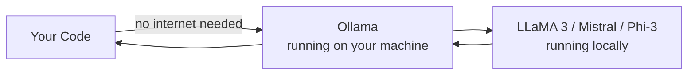

**Setup (one time):**

```bash
# 1. Download Ollama from https://ollama.com
# 2. Pull a model (e.g. LLaMA 3 8B — about 4.7GB)
ollama pull llama3
# 3. Ollama runs as a local server on port 11434
```

**LangChain usage (local, free):**

```python
from langchain_ollama import ChatOllama

llm = ChatOllama(
    model="llama3",   # must be pulled with: ollama pull llama3
    # No API key needed — it talks to your local Ollama server
)
response = llm.invoke("What is RAG?")
print(response.content)
```

**Requirements for running locally:**

- At least **8 GB RAM** for a 7B/8B model
- At least **16 GB RAM** for a 13B model
- A GPU helps but is not required (it runs on CPU — just slower)

---

### Side-by-Side Comparison

|                     | Paid API             | Free-Tier API          | Local (Ollama)               |
| ------------------- | -------------------- | ---------------------- | ---------------------------- |
| **Cost**            | Pay per token        | Free (rate-limited)    | Completely free              |
| **Setup**           | Get API key          | Get API key            | Install Ollama               |
| **Quality**         | Best (GPT-4, Claude) | Good (Gemini Flash)    | Good (LLaMA 3, Mistral)      |
| **Speed**           | Fast                 | Fast                   | Depends on your hardware     |
| **Internet needed** | Yes                  | Yes                    | No                           |
| **Data privacy**    | Sent to provider     | Sent to provider       | Stays on your machine        |
| **Rate limits**     | None (just cost)     | Yes — limited          | None                         |
| **Best for**        | Production apps      | Learning / prototyping | Privacy / offline / learning |

---

### Recommendation for Learners

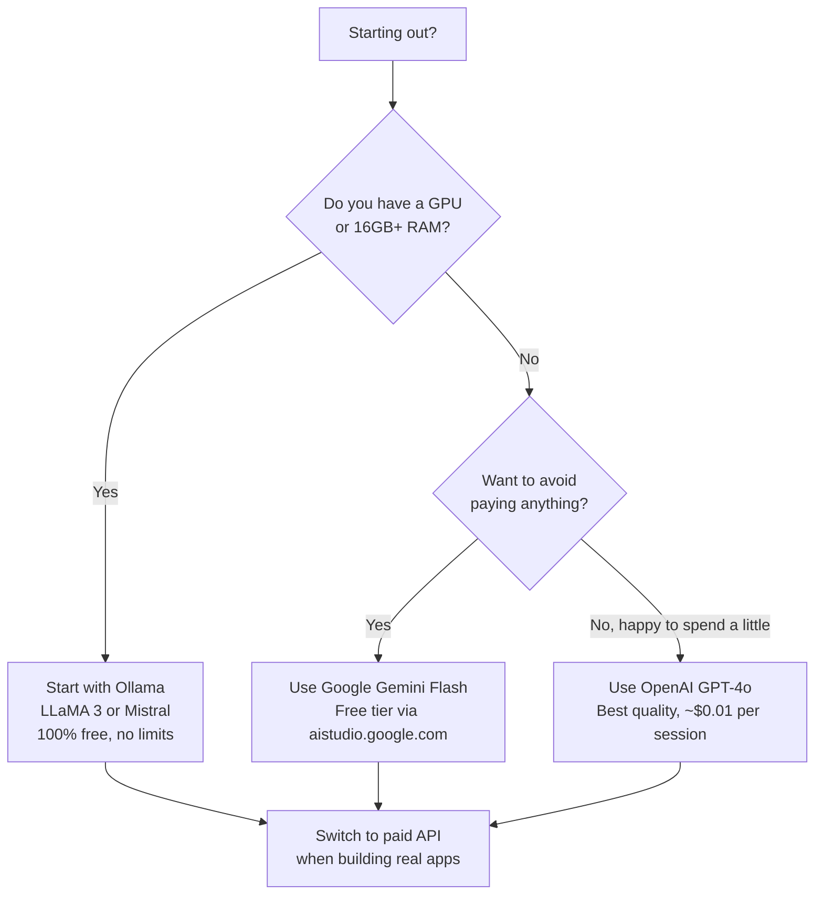

> **Practical tip:** Start with Gemini Flash (free) or Ollama (local) to learn LangChain. Once your app is real and needs the best quality, switch to GPT-4o or Claude — your LangChain code stays exactly the same.

---

## Message Types — The Building Blocks of a Conversation

Before diving into memory, it's important to understand the **three types of messages** that flow in and out of an LLM. Every conversation is just a list of these messages — and memory is simply the act of storing and replaying them.

### The Three Message Types

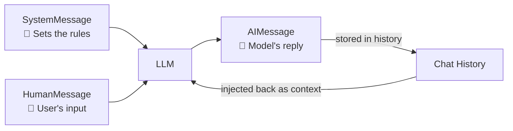

| Message Type      | Who Sends It        | What It Does                                                        |
| ----------------- | ------------------- | ------------------------------------------------------------------- |
| **SystemMessage** | You (the developer) | Sets the AI's personality, role, and rules — sent once at the start |
| **HumanMessage**  | The user            | The actual question or input from the user                          |
| **AIMessage**     | The LLM             | The response generated by the model                                 |

---

### SystemMessage — Setting the Rules

The system message is like a **job briefing** you give to the AI before the conversation starts. The user never sees it — it's your way of telling the model how to behave.

```python
from langchain_core.messages import SystemMessage, HumanMessage

messages = [
    SystemMessage(content="You are a helpful AI tutor who explains things simply."),
    HumanMessage(content="What is an embedding?")
]

response = llm.invoke(messages)
print(response.content)
# AIMessage: "An embedding is a way of turning words into numbers..."
```

Common things set in a SystemMessage:

- Persona: `"You are a friendly customer support agent"`
- Language: `"Always reply in French"`
- Format: `"Always respond in JSON"`
- Constraints: `"Never discuss competitors"`

---

### HumanMessage — The User's Input

This is simply whatever the user typed. Every turn the user takes becomes a `HumanMessage`.

```python
HumanMessage(content="Explain what RAG means")
```

---

### AIMessage — The Model's Reply

Every response from the LLM comes back as an `AIMessage`. This is what gets stored in the conversation history so the model can refer back to what it said earlier.

```python
# response from llm.invoke(...) is an AIMessage
print(type(response))   # <class 'langchain_core.messages.ai.AIMessage'>
print(response.content) # "RAG stands for Retrieval-Augmented Generation..."
```

---

### Are These Part of History?

**Yes — chat history is literally just a list of these three message types, in order.**

```python
# A full conversation stored as a list of messages:
history = [
    SystemMessage(content="You are a helpful tutor."),
    HumanMessage(content="What is LangChain?"),
    AIMessage(content="LangChain is a framework for building LLM applications."),
    HumanMessage(content="Give me an example."),
    AIMessage(content="Sure! Here's a simple chain..."),
]

# On the next turn, you append the new message and send the whole list:
history.append(HumanMessage(content="How does memory work?"))
response = llm.invoke(history)
history.append(response)  # AIMessage gets added back to history
```

This is exactly what LangChain's memory components manage for you automatically — instead of building and maintaining this list yourself, memory handles appending, trimming, and summarising it.

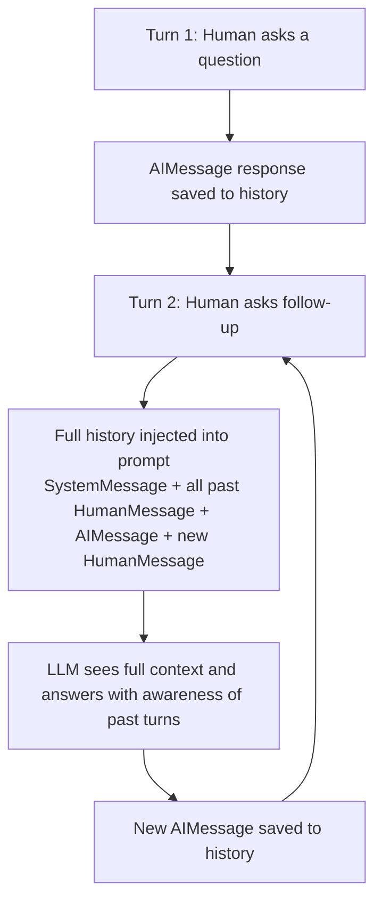

> **Key insight:** The LLM itself has no memory. It's stateless. What creates the illusion of memory is simply sending the entire conversation history with every single request. Memory components just make managing that list easier.

---

## Memory Types — A Deeper Look

We covered memory briefly earlier. Let's go deeper — because there are several ways to implement memory, each with trade-offs.

### Why Memory Is Hard

LLMs process everything in a **context window** — think of it like the model's short-term attention span. If a conversation gets too long, early messages fall outside the window and the model "forgets" them.

```
Context Window (e.g. 8,000 tokens ~ 6,000 words)
┌────────────────────────────────────────────────┐
│  System prompt │ Past messages │ New message   │
└────────────────────────────────────────────────┘
                          ↑
               As conversation grows,
               old messages get dropped
```

### The 4 Main Memory Types

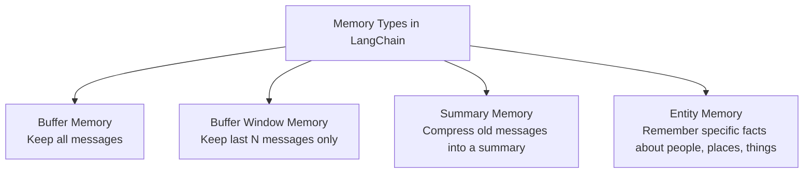

#### 1. Buffer Memory — Keep Everything

Stores the **entire conversation history** and sends it all back with every message. Simple but gets expensive and slow as conversations grow.

```
Message 1: "My name is Vishal"
Message 2: "I work in Munich"
Message 3: "What is my name?"  ← LLM sees ALL 3 messages → "Your name is Vishal" ✅
```

**Good for:** Short conversations  
**Bad for:** Long sessions — you'd be sending thousands of words with every message

---

#### 2. Buffer Window Memory — Keep the Last N Messages

Only keeps the **most recent N messages**. Older messages are dropped. Keeps costs low but the model can forget things from earlier in a long chat.

```
Window = last 3 messages

Message 1: "My name is Vishal"         ← dropped when window moves
Message 2: "I work in Munich"          ← dropped
Message 3: "I like Python"
Message 4: "I prefer dark themes"
Message 5: "What is my name?"          ← LLM only sees messages 3, 4, 5 → "I don't know" ❌
```

**Good for:** Keeping token costs low  
**Bad for:** When you need to remember things from early in the conversation

---

#### 3. Summary Memory — Compress and Remember

Instead of storing raw messages, it periodically **summarises** the conversation so far and stores just the summary. Much more space-efficient while still keeping the general context.

```
Original messages (500 words):
  "Vishal said he works in Munich, likes Python,
   prefers dark mode, is learning AI..."
          ↓ Summary Memory compresses ↓
Summary (50 words):
  "The user is Vishal, a developer in Munich who
   likes Python and is learning AI."
```

**Good for:** Long conversations where you want to preserve key context  
**Bad for:** When exact wording of past messages matters

---

#### 4. Entity Memory — Remember Specific Facts

Tracks **specific named entities** (people, places, things) and remembers facts about them. It builds a little knowledge base from the conversation.

```
User says: "My colleague Sarah joined our team last week."
User says: "Sarah is working on the billing module."

Entity Memory stores:
  Sarah → joined last week, working on billing module

Later: "What is Sarah working on?"
LLM: "Sarah is working on the billing module." ✅
```

**Good for:** Conversations that mention specific people, projects, or concepts that need to be tracked

---

### Memory Type Comparison

| Memory Type       | What It Stores           | Token Cost | Best For                 |
| ----------------- | ------------------------ | ---------- | ------------------------ |
| **Buffer**        | All messages             | High       | Short chats              |
| **Buffer Window** | Last N messages          | Low        | Cost-conscious apps      |
| **Summary**       | A compressed summary     | Medium     | Long conversations       |
| **Entity**        | Facts about named things | Low-Medium | Tracking people/projects |

---

## Putting It All Together — The Big Picture

Here's how all the concepts in this repository connect:

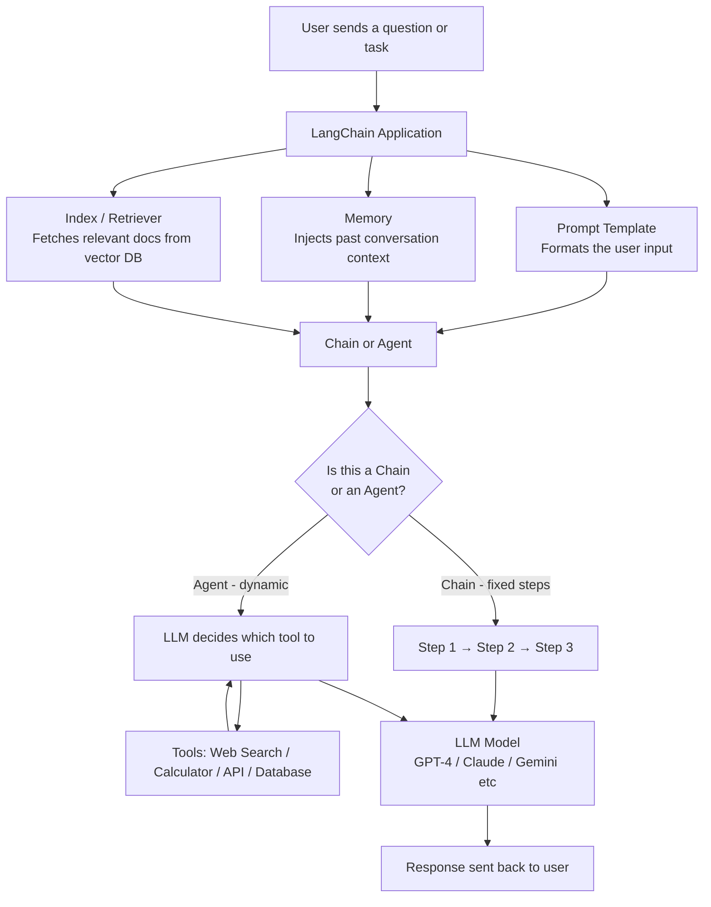

### The Three Layers of a Generative AI App

```
┌─────────────────────────────────────────────────────────┐
│                   APPLICATION LAYER                     │
│   Your app UI + LangChain (prompts, chains, memory,     │
│   indexes, agents)                                      │
├─────────────────────────────────────────────────────────┤
│                   MODEL / PROVIDER LAYER                │
│   OpenAI, Anthropic, Google, Meta, Mistral...           │
│   Accessed via API                                      │
├─────────────────────────────────────────────────────────┤
│                   RESEARCH / FOUNDATION LAYER           │
│   Transformers, Attention, Pre-training, RLHF...        │
│   (you don't build this — you understand it)            │
└─────────────────────────────────────────────────────────┘
```

As a developer building AI applications, you mostly **live in the top layer** — using LangChain as your toolkit, connecting to providers in the middle layer, with enough understanding of the bottom layer to know what's happening under the hood.
